# Introduction

Swingy is a Java-based RPG where players control a hero through a square
map populated by villains. The game follows the **Model-View-Controller
(MVC)** pattern and supports both Console and GUI interfaces with the
ability to switch between them at runtime.

# Swingy — Game Design Document

## 1. High Concept
Swingy is a Java RPG where the player controls a hero in a procedurally generated **square maze** populated by enemies.

Objective per run: **reach an exit on the maze edge** before dying.

Front-ends:
- Console (CLI)
- Swing GUI

View is selected at launch:
```bash
java -jar swingy.jar console
java -jar swingy.jar gui
```
Runtime view switching is not implemented.

---

## 2. Core Loop
### 2.1 Starting Screen
On entering the starting screen, the game prints the list of available heroes automatically.

Actions:
- Create a hero
- Load an existing hero
- List heroes

### 2.2 Exploration (turn-based with enemy movement)
Exploration is turn-based: the world updates only after a player command.

Walkability (player):
- The player can move onto: floor `.`, potion `!` (without consuming it), and exit `X` (triggers victory).
- The player cannot move onto: wall `#` or outside maze bounds.

Invalid movement:
- Attempting to move into a wall/out of bounds consumes a turn.
- Print: `"You cannot go there."`
- Enemies still perform their post-move movement phase.

**Player movement turn order**
1. Player attempts to move 1 tile (N/E/S/W).
2. If the destination is an enemy tile, an encounter starts immediately.
3. Otherwise, enemies resolve movement **one at a time**:
   - Iterate the current enemy list in its stored order.
   - For each enemy:
     1. Roll a move chance. On success (**25%**), attempt to move.
     2. Compute the set of free neighboring tiles (N/E/S/W) that are walkable.
        - Enemies cannot move through walls.
        - An enemy cannot move onto a tile occupied by:
          - another enemy
          - an exit
          - the potion
        - An enemy **can** move onto the player tile.
        - An enemy **can** move onto the tile the player just left.
        - The hero-start tile is just a floor tile; enemies can move onto it.
     3. If there is at least one valid tile, pick one uniformly at random and move.
        - If there are **no** valid neighboring tiles, the enemy stays in place.
        - If two enemies would move into the same tile, earlier enemies in the iteration order move first; later enemies see the tile as occupied and therefore cannot move there.
   - If an enemy moves onto the player, mark an encounter as pending, but **continue moving the remaining enemies**. After all enemy moves are processed, start the encounter.

There is no dedicated map-inspection command; the fog-of-war viewport is rendered automatically before each in-mission input read.

### 2.3 Win/Lose
- **Win:** reaching any exit tile on the maze edge.
  - Show win message.
  - Save hero.
  - Hero HP carries over (saved current HP).
  - Return to starting screen.
  - Next time the hero is loaded, a **new maze** is generated.
- **Lose:** hero HP reaches 0.
  - Delete hero from persistence.
  - Return to starting screen.

---

## 3. Commands
Unknown command behavior:
- **Exploration:** unknown command does **not** consume a turn. Print:
  ```text
  Unknown command. Available commands: north (n), south (s), east (e), west (w).
  ```
- **Combat:** unknown command **does** consume the turn (treated as Idle). Print:
  ```text
  Unknown command. Available commands: attack (a), defend (d), sunder (s)
  ```

Input prompt:
- In both console and GUI modes, every input read is prefixed with `> `.
- Examples: `> attack`, `> north`.

### 3.1 Starting Screen
- `list`: list available heroes (also printed automatically on entering the starting screen).
- `load <name>`: load an existing hero by name.
  - If the save cannot be loaded for any reason (file missing/corrupt, invalid CSV format, unknown name, invalid class/name fields, negative numbers/out-of-range integers): print `"Could not load save."`
- `create <class> <name>`: create a new hero.
  - `<class>` must be exactly one of: `warrior`, `rogue`, `mage` (case-sensitive).
  - `<name>` must follow the persistence name constraints: `[A-Za-z0-9_-]{1,16}` and be unique.
  - If the name already exists: print `"A character with the name already exists, pick another name."`

### 3.2 In-Game (Exploration)
- Movement: `north|south|east|west` (aliases: `n|s|e|w`)
- Map: the fog-of-war viewport is printed automatically before each in-mission input read.
  - If the hero steps onto the potion tile, print the drink prompt (see Health).

Minimalism decisions:
- No `help` command (unknown-command output lists available commands).
- No `info` command. Stats/equipment are displayed in the prompt/status line every turn.
- No in-game `quit` command.

Exiting:
- CLI: Ctrl-D (EOF) exits and prints: `EOF received (Ctrl-D). Your progress has been saved. Goodbye!`
- GUI: closing the window exits.
- During combat, quit attempts are blocked in both modes and print: `You cannot quit now.`
- Exiting mid-mission saves only the hero state (stats/xp/gear/current HP). On next load, a new maze is generated (see Persistence).

### 3.3 Combat
Accepted commands:
- `attack` (alias: `a`)
- `defend` (alias: `d`)
- `sunder` (alias: `s`)

Any other command: print the combat unknown-command message and consume the turn as Idle:
```text
Unknown command. Available commands: attack (a), defend (d), sunder (s)
```

---

## 4. Hero
### 4.1 Stats
Primary stats:
- **ATK**: increases damage dealt
- **DEF**: reduces damage taken
- **HP**: damage the hero can sustain

Level-up increases base stats:
- ATK +5
- DEF +5
- Max HP +10

### 4.2 Classes
All heroes start with no equipment.

Level 1 baselines:
- Warrior: HP 125 / ATK 10 / DEF 20
- Rogue:   HP 100 / ATK 15 / DEF 15
- Mage:    HP  75 / ATK 20 / DEF 10

---

## 5. Leveling and XP
Level thresholds follow the subject formula:
```text
XP_total(level) = level * 1000 + (level - 1)^2 * 450
```

- No level cap.

XP gain (simple, self-tuning):
- Let `L` be the hero level.
- Compute the XP gap to next level:
  ```text
  xpToNext = XP_total(L + 1) - XP_total(L)
  ```
- Each defeated enemy grants:
  ```text
  xpGain = round(xpToNext / K)
  ```
  where `K` is the target number of kills per level (tunable constant; default `K = 15`).

Notes:
- This keeps leveling pace roughly stable as level increases.
- Uniques (L+2) are harder fights but do not need special XP rules under this model.

---

## 6. World
### 6.1 Maze Size
Maze is a square grid.

Raw size (subject formula):
```text
MapSizeRaw = (level - 1) * 5 + 10 - (level % 2)
```

Hard cap (safety):
- Safety cap to avoid unbounded runtime/memory if level becomes unexpectedly large (corrupt save, tester edits, bugs).
```text
MAP_SIZE_CAP = 55
MapSize = min(MapSizeRaw, MAP_SIZE_CAP)
```

Hero starts at the center.

### 6.2 Tiles and Fog of War (mandatory)
Symbols (CLI):
- Player: `@`
- Floor: `.`
- Wall: `#`
- Exit: `X` (four exits; one per edge)
- Potion: `!`
- Enemies: `M` (regular mob), `U` (unique)
- Out-of-bounds padding: ` ` (space)

Rendering rules (overlay entities):
- The maze terrain is `#` (wall), `.` (floor), `X` (exit).
- Potions and enemies are **overlay entities** rendered on top of floor tiles (they never replace walls).
- Overlay precedence in CLI viewport rendering:
  - Enemy > potion > floor
  - Player > potion > floor
  - (Player and enemy cannot both be shown in exploration, because an encounter starts immediately when stepping onto an enemy tile.)
- Overlay precedence in GUI world rendering:
  - Player > enemy > potion > floor
  - (Player may share a tile with an enemy at encounter start; the player sprite is drawn on top.)

Fog-of-war is mandatory (viewport-based rendering):
- The logical map view is a fixed-size **11x11** window centered on the hero.
- The viewport is printed automatically before each in-mission input read.
- If the window extends outside the maze bounds, out-of-bounds cells are spaces (` `).
- CLI output trims fully blank top/bottom rows and prints exactly one blank line above and below the visible map block.
- The window shows all entities/tiles inside it (walls, floors, exits, potion, enemies); there is no line-of-sight blocking by walls.

Example viewport output (11x11 window):
```text
 ####X####
 #.......#
 #.#####.#
 #.#.....#
 X.#..##.X
 #.#.@!#.#
 #.#####.#
 #.M.M...#
 ####X####
```

### 6.3 Maze Generation (self-contained)
Map size:
- Given hero level `L`, compute:
  ```text
  MapSizeRaw = (L - 1) * 5 + 10 - (L % 2)
  MapSize = min(MapSizeRaw, 55)
  ```
- Maze size is `MapSize × MapSize`.

Grid:
- Coordinates are `(x, y)` with `0 <= x,y < MapSize`.
- Initialize every tile as a **wall** `#`.

Carving model:
- Maze corridors are carved on a lattice of **cells** located at odd coordinates `(1..MapSize-2 step 2)`.
- A carved corridor tile is a **floor** `.`.

Recursive Backtracking (DFS) algorithm:
1. Compute the hero spawn position `start = (MapSize/2, MapSize/2)`.
2. Compute the carve start cell `carveStart` using an odd-center rule (as in the Python prototype):
   - `oddCenter(n) = c + (c % 2 == 0 ? 1 : 0)` where `c = n / 2` (integer division)
   - `carveX = oddCenter(MapSize)`
   - `carveY = oddCenter(MapSize)`
   - `carveStart = (carveX, carveY)`
   - This is guaranteed in-bounds because `MapSize` is odd (from the map-size formula) and `>= 9`.
3. Mark `carveStart` as floor.
4. Maintain a stack of cells. Push `carveStart`.
5. While stack not empty:
   - Let `c` be the top cell.
   - Collect all unvisited neighbor cells at distance 2 in the four directions:
     - `n = (c.x + 2*dx, c.y + 2*dy)` where `(dx,dy)` ∈ {(1,0),(-1,0),(0,1),(0,-1)} and `n` stays inside the cell lattice.
   - If at least one neighbor exists:
     - Pick one uniformly at random.
     - Carve the wall between them: set `(c.x + dx, c.y + dy)` to floor.
     - Set `n` to floor and push `n`.
   - Else pop.

Hero spawn tile:
- Ensure the hero start tile `(MapSize/2, MapSize/2)` is a floor `.` (carve it if needed).

Exits:
- Create **four exits** `X`, centered on each edge:
  - North: `(MapSize/2, 0)`
  - South: `(MapSize/2, MapSize-1)`
  - West:  `(0, MapSize/2)`
  - East:  `(MapSize-1, MapSize/2)`
- For each exit, ensure the adjacent interior tile is floor (carve it if needed):
  - North adjacent: `(MapSize/2, 1)`
  - South adjacent: `(MapSize/2, MapSize-2)`
  - West adjacent: `(1, MapSize/2)`
  - East adjacent: `(MapSize-2, MapSize/2)`

Reachability guarantee:
- After generation, run a BFS/DFS from the hero start over walkable tiles (`.` and `X`).
- If any exit is unreachable, regenerate the maze.

### 6.4 Placement (self-contained)
Walkable tiles are floors `.` and exits `X`.

#### Potion placement (exactly 1 per maze)
Potions are overlay entities (they do not replace the underlying terrain; they are rendered above floor tiles).

1. Compute dead ends:
   - A dead end is a floor tile `.` with exactly **one** walkable neighbor among its 4 cardinal neighbors.
2. Apply distance constraint:
   - Keep only dead ends with Manhattan distance from hero start `>= N`, where `N = floor(MapSize/4)`.
3. Choose a tile:
   - If the filtered dead-end list is non-empty, pick one uniformly at random.
   - Otherwise, pick any floor tile satisfying the same distance constraint.
4. Place the potion entity at that coordinate.

Potion constraints:
- Potion cannot be placed on an exit.

#### Enemy placement
Enemy count:
```text
NumEnemies = floor((MapSize * MapSize) / 32)
```

Placement constraints:
- Enemies spawn only on floor tiles `.`.
- Enemies cannot spawn on:
  - exits `X`
  - the potion `!`
  - the hero start tile
  - another enemy

Anti-spawnkill / spacing:
- Minimum Manhattan distance from hero start: `minStartDist = floor(MapSize/6)`.
- Minimum Manhattan distance between enemies: `minEnemyDist = floor(MapSize/8)`.

Algorithm:
1. Build a list of candidate floor tiles excluding hero start, exits, and potion.
2. Shuffle candidates.
3. Iterate candidates and place an enemy whenever constraints are satisfied until `NumEnemies` enemies are placed.
4. If you cannot place all enemies under constraints, relax `minEnemyDist` by 1 and retry.
   - Retry at most 3 times (total 4 placement attempts).
   - If still not enough enemies can be placed, keep fewer enemies (use whatever was placed in the final attempt) and proceed.

---

## 7. Enemies

Enemies are primarily **cosmetic**. All normal enemies share the same stat-generation rules; only the name/sprite changes.

### 7.1 Enemy roster (cosmetic)
Default normal enemy name pool (15, from DCSS):
- Kobold
- Goblin
- Orc
- Orc wizard
- Skeleton
- Zombie
- Ogre
- Troll
- Centaur
- Yak
- Ice beast
- Jelly
- Killer bee
- Spiny frog
- Two-headed ogre

Unique name pool (10, from DCSS):
- Grinder
- Jessica
- Sigmund
- Crazy Yiuf
- Prince Ribbit
- Pikel
- Urug
- Harold
- Rupert
- Louise

Name selection:
- When spawning a normal enemy, pick a random name from the normal pool.
- When spawning a unique, pick a random name from the unique pool.

What is displayed:
- The map only shows `M` or `U` for enemies (no per-name symbols).
- The enemy name is shown in the encounter prompt and in the combat log/telegraphs.

Map symbols:
- Normal enemy: `M`
- Unique enemy: `U`

### 7.2 Stat generation (Rogue baseline)
Enemy power is driven by enemy level.

Enemy level:
- **Regular mob:** `enemyLevel = heroLevel` (`L`).
- **Unique:** `enemyLevel = heroLevel + 2` (`L+2`).

Reference-stats model (Rogue baseline):
- Compute base stats for a reference Rogue at level `E = enemyLevel`:
  ```text
  rogueBaseHp(E)  = 100 + (E - 1) * 10
  rogueBaseAtk(E) =  15 + (E - 1) * 5
  rogueBaseDef(E) =  15 + (E - 1) * 5
  ```
- Enemy stats are:
  ```text
  hp  = rogueBaseHp(E)
  atk = rogueBaseAtk(E)
  def = rogueBaseDef(E)
  ```
- Enemies spawn at full HP.

### 7.3 Unique spawn rule (maze-level)
Each maze has a chance to contain **at most one** unique.

- Probability: `pMazeUnique = 25%`.
- If `NumEnemies == 0`, no unique spawns.
- If a unique spawns, it replaces one of the normal enemies (no placement changes):
  - After generating the list of placed enemies, pick one uniformly at random and convert it to a unique.
  - This conversion does not change coordinates; it only changes the enemy’s name/symbol/stats.
  - Set its symbol to `U`, name from the unique pool, and `enemyLevel = heroLevel + 2`.
  - The unique follows the same movement and encounter rules as normal enemies.

### 7.4 Encounters
Encounter starts when:
- Hero steps onto an enemy tile, OR
- An enemy moves onto the hero tile during the post-move enemy phase.

Prompt:
- `"You have encountered <EnemyName>, do you want to fight [Y/n]?"`
- This prompt is **untimed**.
- Accepted inputs:
  - `y` or empty input ⇒ fight
  - `n` ⇒ attempt to run
- Invalid input ⇒ print `"Please answer with y or n."` and re-prompt.

Run rule:
- If player chooses to run (including against uniques): 50% chance to return to previous tile; otherwise combat starts.

---

## 8. Combat
### 8.1 Instanced combat
Combat is instanced: only the hero and current enemy are updated until the fight resolves.

### 8.2 Timed combat input
- Exploration: no timer.
- Combat: player has a deadline per action (target: **3 seconds**).
- The timer starts **after** the enemy telegraph and the player prompt are printed.
- On timeout: player action becomes **Idle**.
- Invalid input consumes the turn (treated as **Idle**).

QTE timing:
- QTE uses its own fresh **3-second** input window.
- After the QTE is resolved, combat continues normally with the next telegraph/prompt.

Implementation:
- GUI: Swing timer.
- CLI: input thread + queue, combat loop `poll(timeout)`.
  - Call `clearPending()` before each timed prompt to discard late-entered lines.

### 8.3 Actions (RPS)
Round structure:
1. Enemy chooses an action (uniform random).
2. Enemy telegraphs the action (color-coded).
3. Player enters an action within the deadline.
4. Resolve the exchange (including any QTE).
5. Next round.

Actions:
- Attack
- Defend
- Sunder

Enemy telegraphs its next action.

Enemy action selection:
- Each enemy action is chosen uniformly at random from {Attack, Defend, Sunder}.

Combat resolution matrix:

- Base damage:
  ```text
  BaseDamage = max(1, (AttackerATK * 200) / (100 + DefenderDEF))
  ```
- Final damage:
  ```text
  FinalDamage = BaseDamage * RpsMultiplier
  ```

| Enemy Action | Player Attack                                | Player Defend                          | Player Sunder                                                                         |
| :----------- | :------------------------------------------- | :------------------------------------- | :------------------------------------------------------------------------------------ |
| Attack       | QTE: Winner deals 1.5× dmg, loser deals 0    | Player blocks, Enemy takes 1.0x Dmg    | Player takes 1.5x Dmg                                                                 |
| Defend       | Enemy blocks, Player takes 1.0x Dmg          | QTE: Succ = Pl Heals / Fail = En heals | Enemy takes 1.0x Dmg                                                                  |
| Sunder       | Enemy takes 1.5x Dmg                         | Player takes 1.0x Dmg                  | QTE: Succ = Apply **Armor Broken** to enemy / Fail = Apply **Armor Broken** to player |

Notes:
- “Blocks” means the blocker takes **0 damage** for that exchange.
- Attack-vs-Attack (QTE): high risk.
  - QTE winner deals 1.5× damage.
  - QTE loser deals **0** damage.
- “Player blocks, Enemy takes 1.0× Dmg” (Enemy Attack vs Player Defend) is a **riposte**: the player chose the correct response and deals riposte damage.
- “Enemy blocks, Player takes 1.0× Dmg” (Enemy Defend vs Player Attack) is a **counterattack**: the player chose the wrong response and is punished.
- Riposte/counterattack damage uses the same base formula, with the riposter as the attacker:
  ```text
  RiposteBaseDamage = max(1, (RiposterATK * 200) / (100 + TargetDEF))
  RiposteFinalDamage = RiposteBaseDamage * 1.0
  ```
  - In these exchanges, only the riposte/counterattack damage is applied (the blocked side deals 0 damage).
- Idle action semantics (timeout/invalid/unknown input):
  - Idle is not a selectable action; it is a fallback only.
  - Idle does not trigger QTE.
  - If enemy action is Attack: player takes 1.0× enemy damage.
  - If enemy action is Sunder: player takes 1.0× enemy damage.
  - If enemy action is Defend: enemy heals (same amount as Defend-vs-Defend QTE heal; default 10% of base max HP).
- Defend-vs-Defend QTE healing amount is tunable; default: heal **10% of base max HP**.
  - On QTE success: **player** heals.
  - On QTE failure: **enemy** heals the same amount.
  - Healing is capped at max HP.
- **Armor Broken**: applies to the QTE loser for the **next turn** (regardless of chosen action).
  - For any damage calculation where the Armor-Broken target is the defender, treat their DEF as `floor(DEF * 0.7)`.
  - After that next turn is resolved, remove the debuff.

### 8.4 QTE (supported)
QTE triggers when both sides choose the same action.
- Print 3 random letters (e.g. `ayn`).
- The player must type them and press ENTER within the combat deadline.
- Timeout/incorrect input counts as QTE failure.

Enemy telegraphing:
- The enemy’s next action is announced before the player chooses.
- Color coding is used in **both** CLI and GUI:
  - Attack = Red
  - Defend = Blue
  - Sunder = Green
- CLI uses ANSI escape codes for colors.

---

## 9. Health
Definitions:
- **Base max HP**: hero class + level HP without helm bonus.
- **Effective max HP**: base max HP + helm HP bonus.

- No passive regeneration.
- Healing:
  1. Potion: heals **50% of base max HP**.
  2. Defend-vs-Defend may allow a heal (via QTE outcome).

Potion interaction rules:
- If the hero steps onto the potion tile, immediately show the prompt:
  - `"You have found a health potion, do you want to drink it [Y/n]?"`
- If the player answers `Y`, the potion is consumed, heals **50% of base max HP** (capped at effective max HP), and the potion disappears.
- If the player answers `n`, nothing happens and the potion remains on the tile.
- The potion tile is passable; stepping onto it always triggers the prompt. The prompt is shown again the next time the hero steps onto the potion tile.

---

## 10. Artifacts / Equipment
No inventory. Equip-or-leave.

Slots:
- Weapon: +ATK
- Armor: +DEF
- Helm: +HP

### 10.1 Drops
Drop rates (defaults):
- Regular mob: **35%** chance to drop 1 artifact.
- Unique: **100%** chance to drop 1 artifact.

Dropped artifact modifier:
```text
mod = enemyLevel - 1
```

Item naming convention (derived from hero class and slot):
- Warrior: `Sword`, `Plate Armor`, `Steel Helm`
- Rogue: `Dagger`, `Leather Armor`, `Leather Helm`
- Mage: `Staff`, `Robe`, `Wizard Hat`

Displayed format:
- `<BaseName> +<mod>` (example: `Sword +7`)

### 10.2 Diminishing returns (no rarity names)
Artifacts are labeled `+mod`.

Convert display modifier to power:
```text
effectiveMod(mod) = floor(k * ln(1 + mod))
```
- `ln` is natural log; Java: `Math.log(1 + mod)`.
- Tune `k`. Calibration option: `effectiveMod(10) = 10` ⇒ `k ≈ 4.17`.

Step constants (chosen):
- `atkStep = 3`
- `defStep = 3`
- `hpStep  = 5`

Bonus formulas:
```text
weaponAtkBonus = atkStep * effectiveMod(mod)
armorDefBonus  = defStep * effectiveMod(mod)
helmHpBonus    = hpStep  * effectiveMod(mod)
```

Final stat bonuses are linear in `effectiveMod` using these step constants.

Equip timing:
- Artifact prompts are **untimed** and are shown **after combat ends**, never during combat.

Prompt:
- `"You have found <BaseName> +<mod> (+<bonus> <stat>), do you want to equip it [Y/n]?"`
  - Example: `"You have found Sword +7 (+21 ATK), do you want to equip it [Y/n]?"`
- Accepted inputs:
  - `y` or empty input ⇒ equip
  - `n` ⇒ discard
- Invalid input ⇒ print `"Please answer with y or n."` and re-prompt.

Equip rules:
- Equipping always replaces the currently equipped item in that slot (if any). The old item is discarded.
- If equipping a helm changes effective max HP, keep current HP as-is but cap it to the new effective max HP.

---

## 11. Persistence
Persistence uses a CSV text file.

File:
- Path: `heroes.csv`
- Encoding: UTF-8
- One hero per line.

Name constraints (to avoid CSV escaping):
- Hero names must match: `[A-Za-z0-9_-]{1,16}`
- Names are unique.

CSV columns (per line):
1. `name`
2. `class` (`WARRIOR|ROGUE|MAGE`)
3. `level` (int)
4. `xp` (int)
5. `currentHp` (int)
6. `weaponMod` (int)
7. `armorMod` (int)
8. `helmMod` (int)

Example line:
```text
Alice,WARRIOR,3,1520,128,4,2,1
```

Save rules (explicit):
- The game is saved when:
  1. The player completes a mission (reaches an exit), or
  2. The player dies, or
  3. The player exits the program mid-mission (Ctrl-D / window close).
- Mid-mission exit saves only the **hero state** (stats/xp/gear/current HP). On next load, a **new maze** is generated.

Hero deletion on death:
- Death removes the hero from persistence immediately by deleting their CSV line (rewrite file without that hero).

Atomic save:
- Write to a temporary file then rename to `heroes.csv`.

Persisted (at save time):
- hero identity (name/class)
- level/xp
- current HP
- equipped artifact modifiers (weapon/armor/helm)

Not persisted:
- maze layout
- enemy positions
- potion position

On load, a **fresh maze** is generated for the hero’s level.

---

## 12. UI
A single prompt/status line format is used in **both** CLI and GUI.

Stat definitions (for the prompt):
- `baseAtk/baseDef/baseMaxHp`: hero class baseline + level-up increments only (no artifacts).
- `effectiveAtk/effectiveDef/effectiveMaxHp`: base stat plus equipped artifact bonuses.
- `currentHp` is capped at `effectiveMaxHp`.

Prompt/status line format:
```text
[Lv. <level> <classAbbrev>. | <currentHp>/<baseMaxHp> HP <effectiveAtk>/<baseAtk> ATK <effectiveDef>/<baseDef> DEF | <xp>/<xpToNext> XP]
```
Example:
```text
[Lv. 1 War. | 130/125 HP 13/10 ATK 23/20 DEF | 0/1000 XP]
```

### 12.1 CLI
- Before each in-mission input read, print the status line and the viewport map.
- Every input read prints a `> ` prefix as the input prompt (CLI and GUI).

### 12.2 GUI
- Minimal layout:
  1. World view (sprites)
  2. Log panel
  3. Text input field
  4. The same prompt/status line displayed above the input (or as part of the log)
- Combat deadline enforced via Swing timer.

# Swingy — Technical Specification

This document is the authoritative implementation specification for the Swingy project, using the provided GDD embedded in `README.md` as source of truth.

Hard constraints honored:
- Java **21 LTS**, Maven project.
- No external libraries **except** a `javax.validation` implementation (**Hibernate Validator**) + EL.
- MVC architecture.
- Two views: **CLI** and **Swing GUI**, chosen at launch: `java -jar swingy.jar console|gui`.
- Persistence: **`heroes.csv`** only.
- **No** runtime view switching.
- Simple, implementable design.

---

## 1. Project structure

### 1.1 Maven coordinates
- **groupId**: `com.swingy`
- **artifactId**: `swingy`
- **version**: `1.0.0`
- **packaging**: `jar`

Single-module Maven project.

### 1.2 Packages
Base package: `com.swingy`

Recommended subpackages (strict layering):
- `com.swingy.app` — main entrypoint, wiring, lifecycle
- `com.swingy.controller` — controllers (menu/explore/combat)
- `com.swingy.model` — domain entities (Hero, Enemy, Maze, etc.)
- `com.swingy.model.combat` — combat actions, resolver, debuffs
- `com.swingy.model.world` — maze grid, generation, placement
- `com.swingy.persistence` — CSV repository, parsing/serialization
- `com.swingy.view` — view interfaces
- `com.swingy.view.console` — CLI view implementation
- `com.swingy.view.swing` — Swing view implementation
- `com.swingy.util` — random, scheduler/clock, ansi, small helpers

**Rule**: controllers may depend on model, persistence, util, and view interfaces; views may depend on controller-facing interfaces only (no direct model mutation).

### 1.3 Directory tree

```text
.
├── pom.xml
└── src
    └── main
        ├── java
        │   └── com
        │       └── swingy
        │           ├── app
        │           │   ├── Main.java
        │           │   ├── AppContext.java
        │           │   └── ShutdownManager.java
        │           ├── controller
        │           │   ├── AppController.java
        │           │   ├── MenuController.java
        │           │   ├── GameController.java
        │           │   └── CombatController.java
        │           ├── model
        │           │   ├── Hero.java
        │           │   ├── HeroClass.java
        │           │   ├── Enemy.java
        │           │   ├── Artifact.java
        │           │   ├── Weapon.java
        │           │   ├── Armor.java
        │           │   ├── Helm.java
        │           │   └── Potion.java
        │           ├── model
        │           │   └── combat
        │           │       ├── CombatAction.java
        │           │       ├── CombatOutcome.java
        │           │       ├── CombatRound.java
        │           │       ├── CombatResolver.java
        │           │       ├── QteChallenge.java
        │           │       └── DebuffState.java
        │           ├── model
        │           │   └── world
        │           │       ├── Maze.java
        │           │       ├── TileType.java
        │           │       ├── Position.java
        │           │       ├── MazeGenerator.java
        │           │       ├── EntityPlacer.java
        │           │       └── FogOfWar.java
        │           ├── persistence
        │           │   ├── HeroRepository.java
        │           │   ├── HeroCsvRepository.java
        │           │   ├── CsvHeroParser.java
        │           │   └── CsvHeroSerializer.java
        │           ├── util
        │           │   ├── RandomProvider.java
        │           │   ├── DefaultRandomProvider.java
        │           │   ├── DeterministicRandomProvider.java
        │           │   ├── Scheduler.java
        │           │   ├── ExecutorScheduler.java
        │           │   ├── SwingScheduler.java
        │           │   └── Ansi.java
        │           └── view
        │               ├── View.java
        │               ├── ViewMode.java
        │               ├── RenderColor.java
        │               ├── console
        │               │   ├── ConsoleView.java
        │               │   └── ConsoleInput.java
        │               └── swing
        │                   ├── SwingView.java
        │                   ├── SwingWorldPanel.java
        │                   └── SwingStyles.java
        └── resources
            ├── images
            │   └── (optional sprites/icons)
            └── app.properties
```

Notes:
- `src/test/java` is optional; no external test framework is mandated.
- GUI can be purely geometric rendering; sprites are optional.

### 1.4 `pom.xml` (dependencies limited to validation)

Dependencies:
- `org.hibernate.validator:hibernate-validator` (implements `javax.validation`)
- `org.glassfish:javax.el` (Expression Language implementation for message interpolation)

Shade plugin:
- Build a single runnable fat jar named `swingy.jar` (finalName).
- Set `com.swingy.app.Main` as Main-Class.

Minimal `pom.xml` template (implementation-ready):

```xml
<project xmlns="http://maven.apache.org/POM/4.0.0"
         xmlns:xsi="http://www.w3.org/2001/XMLSchema-instance"
         xsi:schemaLocation="http://maven.apache.org/POM/4.0.0 http://maven.apache.org/xsd/maven-4.0.0.xsd">
  <modelVersion>4.0.0</modelVersion>

  <groupId>com.swingy</groupId>
  <artifactId>swingy</artifactId>
  <version>1.0.0</version>
  <packaging>jar</packaging>

  <properties>
    <maven.compiler.release>21</maven.compiler.release>
    <project.build.sourceEncoding>UTF-8</project.build.sourceEncoding>
  </properties>

  <dependencies>
    <dependency>
      <groupId>org.hibernate.validator</groupId>
      <artifactId>hibernate-validator</artifactId>
      <version>6.2.5.Final</version>
    </dependency>
    <dependency>
      <groupId>org.glassfish</groupId>
      <artifactId>javax.el</artifactId>
      <version>3.0.1-b12</version>
    </dependency>
  </dependencies>

  <build>
    <finalName>swingy</finalName>
    <plugins>
      <plugin>
        <groupId>org.apache.maven.plugins</groupId>
        <artifactId>maven-shade-plugin</artifactId>
        <version>3.6.0</version>
        <executions>
          <execution>
            <phase>package</phase>
            <goals><goal>shade</goal></goals>
            <configuration>
              <createDependencyReducedPom>false</createDependencyReducedPom>
              <transformers>
                <transformer implementation="org.apache.maven.plugins.shade.resource.ManifestResourceTransformer">
                  <mainClass>com.swingy.app.Main</mainClass>
                </transformer>
              </transformers>
            </configuration>
          </execution>
        </executions>
      </plugin>
    </plugins>
  </build>
</project>
```

### 1.5 Main entrypoint behavior and argument parsing

`com.swingy.app.Main` behavior:

- Arguments:
  - exactly **one** argument required: `console` or `gui`.
- If invalid/missing:
  - print usage to `System.err`:
    - `Usage: java -jar swingy.jar console|gui`
  - exit with code `1`.

Launch wiring:
1. Create `Validator` (`Validation.buildDefaultValidatorFactory().getValidator()`).
2. Create `HeroRepository` bound to `heroes.csv` in the working directory.
3. Create `RandomProvider` (`DefaultRandomProvider` using `java.util.random.RandomGenerator` or `SplittableRandom`).
4. Create `Scheduler`:
   - console: `ExecutorScheduler` (ScheduledExecutorService)
   - gui: `SwingScheduler` (wraps Swing `Timer`)
5. Instantiate the chosen `View` implementation.
6. Create `AppController` and call `run()`.

Exit handling:
- On CLI EOF (Ctrl-D), the console input layer prints `EOF received (Ctrl-D). Your progress has been saved. Goodbye!`
- During combat, quit attempts are rejected and print `You cannot quit now.` in both CLI and GUI.
- On program close (EOF in CLI, window close in GUI), if a hero is currently in a mission and combat is not active, the controller triggers **mid-mission save** of hero state (maze not persisted) per GDD.

---

## 2. OOP architecture (MVC)

### 2.1 MVC responsibilities (precise)

**Model (domain state + rules)**
- Holds game state and deterministic rule computations.
- No I/O. No direct references to Swing/console.
- Contains:
  - Entities: `Hero`, `Enemy`, `Artifact` subclasses, `Potion`
  - World: `Maze`, `Position`, `TileType`
  - Pure logic services: `MazeGenerator`, `EntityPlacer`, `CombatResolver`
- Validation annotations live on model DTOs/entities where input enters (hero name/class fields, persisted values).

**View (I/O + rendering)**
- Owns all UI components (CLI output/input; Swing panels, document styles).
- Converts user interactions into raw command lines.
- Displays:
  - log text, prompts, map viewport, status line
  - color coding (ANSI or Swing styles)
- Does not mutate model directly.

**Controller (orchestration + state machine)**
- Parses commands, invokes model logic, updates model state.
- Requests view renders and reads input via view abstraction.
- Enforces turn ordering and timing rules.
- Owns “game mode” transitions:
  - MENU → EXPLORE → ENCOUNTER → COMBAT → PROMPT_ARTIFACT / PROMPT_POTION → EXPLORE

### 2.2 Controllers and their boundaries

- `AppController`
  - Top-level loop: show menu, load/create hero, run mission, return to menu.
  - Owns current `Hero` reference and mission state lifecycle.

- `MenuController`
  - Implements starting screen commands: `list`, `create <class> <name>`, `load <name>`.
  - Uses `HeroRepository` for load/save/delete.
  - Emits `MenuResult`:
    - `START_MISSION(hero)` or `EXIT`

- `GameController`
  - Creates a fresh maze for the hero level.
  - Runs exploration loop (movement + enemy movement phase).
  - Detects victory (`X` reached) and triggers save.
  - Triggers encounters when stepping into enemy or when enemy steps into hero.

- `CombatController`
  - Runs instanced combat loop with timed action input and QTE.
  - Uses `CombatResolver` (pure) + `RandomProvider`.
  - Post-combat: XP grant, level-up, artifact drop and equip prompt.

### 2.3 Data flow definitions (exact sequences)

#### 2.3.1 Start screen (menu)
1. `AppController` enters MENU.
2. View prints heroes automatically (same as `list`).
3. Read untimed command line.
4. `MenuController` parses:
   - `list` → view prints list → stay in MENU
   - `create <class> <name>`
     - validate class (exact case-sensitive: `warrior|rogue|mage`)
     - validate name regex `[A-Za-z0-9_-]{1,16}` and uniqueness
     - create new `Hero` with baseline level 1, xp 0, currentHp = effectiveMaxHp, no gear
     - save hero immediately (optional but recommended for persistence consistency)
     - return `START_MISSION(hero)`
   - `load <name>`
     - repository loads hero by name; any failure prints **exact**: `Could not load save.`
     - return `START_MISSION(hero)`
   - EOF / window close → return `EXIT`

#### 2.3.2 Mission initialization
1. `GameController.startMission(hero)`:
   - compute map size from level (formula + cap)
   - generate maze with recursive backtracking
   - enforce reachability regeneration
   - place potion (exactly 1)
   - place enemies (count formula + spacing/relax)
   - apply unique rule (25% chance, at most one, replaces one enemy)
   - set hero position to center `(size/2, size/2)`
2. View prints status line.

#### 2.3.3 Exploration turn (player command → world update)
Exploration loop iteration:
1. Read untimed command.
2. Parse command:
   - movement: `north|south|east|west` and aliases `n|s|e|w`
   - unknown

Movement command turn order (GDD exact):
1. Save `turnStartPos = hero.pos`.
2. Render the fog-of-war viewport centered on the hero.
3. Attempt to move 1 tile.
   - if destination is wall or outside bounds:
     - consume the turn
     - print exact: `You cannot go there.`
     - hero remains in place
     - proceed to enemy movement phase
   - if destination is walkable floor/potion/exit:
     - update hero position
     - if destination is exit `X`:
       - victory flow (2.3.7)
     - if destination is occupied by enemy:
       - start encounter immediately (2.3.5)
       - **do not** run enemy movement phase
     - else proceed to enemy movement phase

Map rendering:
- Before each in-mission input read, render the fog-of-war viewport centered on the hero.

Unknown exploration command:
- does **not** consume turn.
- print exact:
  ```
  Unknown command. Available commands: north (n), south (s), east (e), west (w).
  ```

Enemy movement phase (after a movement attempt, even if blocked):
1. For each enemy in stored list order:
   - roll move chance: 25%.
   - if not moving: continue.
   - compute valid neighbors (N/E/S/W) that are walkable and not blocked:
     - cannot move through walls
     - cannot move onto another enemy
     - cannot move onto exit
     - cannot move onto potion
     - can move onto player tile
     - can move onto the tile the player just left
   - choose uniformly random among valid tiles; move.
   - if an enemy moves onto the player, mark `pendingEncounterEnemy` but continue moving remaining enemies.
2. After all enemy moves, if `pendingEncounterEnemy != null`, start encounter (2.3.5).

#### 2.3.4 Enemy movement “pending encounter” ownership
- Only one encounter is started after the phase.
- The encounter enemy is the **first** enemy (in iteration order) that ended on player tile.
- Later enemies cannot enter the player tile because it becomes occupied by an enemy.

#### 2.3.5 Encounter prompt (fight/run)
Trigger:
- hero stepped onto enemy tile, OR
- enemy moved onto hero tile after enemy phase.

Prompt (untimed):
- Print exact:
  - `You have encountered <EnemyName>, do you want to fight [Y/n]?`

Input handling:
- `y` or empty input → fight
- `n` → attempt run
- otherwise:
  - print exact: `Please answer with y or n.`
  - re-prompt

Run resolution:
- 50% chance success.
- Success effect:
  - hero returns to `turnStartPos` (tile occupied at start of the hero’s movement command).
  - If the encounter was caused by enemy movement **and** `turnStartPos` equals current hero tile (rare case: blocked move), then on run success the enemy’s move is undone (enemy returns to its pre-move position tracked by the movement phase). This preserves “return to previous position” semantics and avoids hero/enemy sharing.
- Failure → combat starts.

#### 2.3.6 Potion prompt (on stepping onto potion)
Condition:
- hero moves onto the potion coordinate.

Prompt:
- Print exact:
  - `You have found a health potion, do you want to drink it [Y/n]?`

Input:
- `y` or empty input → consume potion:
  - heal `50% of base max HP` (integer), capped at effective max HP
  - remove potion entity
- `n` → do nothing, potion remains
- invalid → `Please answer with y or n.` and re-prompt

Potion is passable; stepping onto it prompts. The prompt is shown again the next time the hero steps onto the potion tile.

#### 2.3.7 Victory flow
Trigger:
- hero moves onto exit `X`.

Sequence:
1. Print victory message (exact string specified in §11).
2. Save hero to `heroes.csv`.
3. Return to MENU.
4. Next time hero is loaded: generate a **new maze**.

#### 2.3.8 Death flow
Trigger:
- hero current HP reaches 0 in combat.

Sequence:
1. Print death message (exact string specified in §11).
2. Delete hero from `heroes.csv` (remove line).
3. Return to MENU.

#### 2.3.9 Mid-mission exit flow
Trigger:
- CLI: EOF (Ctrl-D)
- GUI: window close

Combat lock:
- If combat is active, quit attempts are rejected and print `You cannot quit now.`
- No save/exit occurs during combat.
- After combat ends, a new quit attempt is required.

Sequence (when not in combat):
1. CLI only: print `EOF received (Ctrl-D). Your progress has been saved. Goodbye!` on EOF.
2. Save hero state to `heroes.csv` (same format), regardless of location.
3. Exit application.

---

## 3. PlantUML class diagram

Paste into any PlantUML renderer.

```plantuml
@startuml
skinparam classAttributeIconSize 0

package "com.swingy.controller" {
  class AppController {
    - MenuController menuController
    - GameController gameController
    + run(): void
  }

  class MenuController {
    - HeroRepository repo
    - javax.validation.Validator validator
    + handleMenu(view: View): MenuResult
  }

  class GameController {
    - MazeGenerator mazeGenerator
    - EntityPlacer entityPlacer
    - CombatController combatController
    - HeroRepository repo
    - RandomProvider rng
    + runMission(view: View, hero: Hero): MissionResult
  }

  class CombatController {
    - CombatResolver resolver
    - RandomProvider rng
    - Scheduler scheduler
    + fight(view: View, hero: Hero, enemy: Enemy): CombatResult
  }
}

package "com.swingy.view" {
  interface View {
    + println(s: String): void
    + println(s: String, color: RenderColor): void
    + renderStatus(status: String): void
    + renderMap(window: char[][]): void
    + readLine(): String
    + readLine(timeoutMillis: long): String
    + clearPendingInput(): void
    + isClosed(): boolean
    + close(): void
  }

  class ConsoleView
  class SwingView

  enum ViewMode {
    CONSOLE
    GUI
  }
  enum RenderColor {
    DEFAULT
    RED
    BLUE
    GREEN
  }

  View <|.. ConsoleView
  View <|.. SwingView
}

package "com.swingy.model" {
  class Hero {
    - String name
    - HeroClass heroClass
    - int level
    - int xp
    - int currentHp
    - int weaponMod
    - int armorMod
    - int helmMod
    + baseAtk(): int
    + baseDef(): int
    + baseMaxHp(): int
    + effectiveAtk(): int
    + effectiveDef(): int
    + effectiveMaxHp(): int
    + applyXp(xpGain: int): void
  }

  enum HeroClass {
    WARRIOR
    ROGUE
    MAGE
  }

  class Enemy {
    - String name
    - boolean unique
    - int level
    - int atk
    - int def
    - int maxHp
    - int currentHp
    - DebuffState debuffs
  }

  abstract class Artifact {
    - int mod
    + displayName(heroClass: HeroClass): String
  }

  class Weapon
  class Armor
  class Helm
  class Potion

  Artifact <|-- Weapon
  Artifact <|-- Armor
  Artifact <|-- Helm
}

package "com.swingy.model.combat" {
  enum CombatAction {
    ATTACK
    DEFEND
    SUNDER
    IDLE
  }

  class CombatRound {
    + CombatAction enemyAction
    + CombatAction playerAction
    + boolean qteTriggered
  }

  class CombatOutcome {
    + int heroDamage
    + int enemyDamage
    + int heroHeal
    + int enemyHeal
    + boolean heroArmorBrokenApplied
    + boolean enemyArmorBrokenApplied
  }

  class QteChallenge {
    + String letters
    + long deadlineMillis
  }

  class DebuffState {
    - int armorBrokenTurns
    + isArmorBroken(): boolean
    + applyArmorBroken(): void
    + tickEndOfRound(): void
  }

  class CombatResolver {
    + resolve(hero: Hero, enemy: Enemy, enemyAction: CombatAction, playerAction: CombatAction, qteSuccess: Boolean): CombatOutcome
  }
}

package "com.swingy.model.world" {
  class Maze {
    - int size
    - TileType[][] terrain
    - Position heroStart
    - Set~Position~ exits
    - Position potionPos
    - List~EnemyInstance~ enemies
    + isInside(p: Position): boolean
    + terrainAt(p: Position): TileType
  }

  enum TileType {
    WALL
    FLOOR
    EXIT
  }

  class Position {
    + int x
    + int y
    + neighbors4(): List~Position~
  }

  class EnemyInstance {
    - Enemy enemy
    - Position pos
    - Position prevPos
  }

  class MazeGenerator {
    - RandomProvider rng
    + generate(size: int): Maze
  }

  class EntityPlacer {
    - RandomProvider rng
    + placePotion(maze: Maze, heroStart: Position): Position
    + placeEnemies(maze: Maze, heroStart: Position): List~EnemyInstance~
    + maybeMakeUnique(enemies: List~EnemyInstance~, heroLevel: int): void
  }

  class FogOfWar {
    + viewport(maze: Maze, heroPos: Position): char[][]
  }
}

package "com.swingy.persistence" {
  interface HeroRepository {
    + list(): List~Hero~
    + loadByName(name: String): Hero
    + save(hero: Hero): void
    + deleteByName(name: String): void
  }

  class HeroCsvRepository {
    - java.nio.file.Path path
    - CsvHeroParser parser
    - CsvHeroSerializer serializer
    - javax.validation.Validator validator
  }

  class CsvHeroParser {
    + parse(line: String): Hero
  }

  class CsvHeroSerializer {
    + serialize(hero: Hero): String
  }

  HeroRepository <|.. HeroCsvRepository
}

package "com.swingy.util" {
  interface RandomProvider {
    + nextInt(bound: int): int
    + nextDouble(): double
    + shuffle(list: java.util.List): void
  }

  class DefaultRandomProvider
  class DeterministicRandomProvider

  RandomProvider <|.. DefaultRandomProvider
  RandomProvider <|.. DeterministicRandomProvider

  interface Scheduler {
    + schedule(delayMs: long, task: Runnable): Cancellable
  }
  interface Cancellable {
    + cancel(): void
  }

  class ExecutorScheduler
  class SwingScheduler

  Scheduler <|.. ExecutorScheduler
  Scheduler <|.. SwingScheduler
}

AppController --> MenuController
AppController --> GameController
GameController --> CombatController
GameController --> HeroRepository
GameController --> MazeGenerator
GameController --> EntityPlacer
CombatController --> CombatResolver
CombatController --> Scheduler

Maze "1" o-- "*" EnemyInstance
EnemyInstance *-- Enemy
Maze "1" o-- Position
Hero "1" o-- DebuffState
Enemy "1" o-- DebuffState

@enduml
```



---

## 4. Patterns to use (minimal, justified)

### 4.1 Strategy — Combat resolution (matrix-based)
Use a `CombatResolver` as a **Strategy** encapsulating the RPS matrix + damage/heal computations.
- Why: isolates combat rules for unit testing and prevents controller bloat.
- Keeps model deterministic: `resolve(...)` is pure given inputs (actions, qte result, stats).

### 4.2 Factory — Hero creation + Enemy creation
- `HeroFactory` (can be static methods on `Hero` or separate class): creates baseline heroes from `(HeroClass, name)`.
- `EnemyFactory`: creates enemies by `(heroLevel, uniqueFlag, rng)` using the “Rogue baseline formula” and name pools.
- Why: centralizes stat formulas and ensures consistent enemy generation across placement and encounters.

### 4.3 Repository — Persistence
`HeroRepository` interface + `HeroCsvRepository` implementation.
- Why: decouples controllers from file I/O and CSV details; makes load failure handling consistent.

### 4.4 State (optional but recommended) — Game modes
Represent mode as an enum or sealed interface:
- `MENU`, `EXPLORE`, `ENCOUNTER`, `COMBAT`, `PROMPT_ARTIFACT`, `PROMPT_POTION`.
- Why: makes “unknown command consumes turn vs not” and “enemy movement only after movement commands” trivial and explicit.
- Keep implementation minimal: a single enum field in `GameController`.

---

## 5. Timed input (combat + QTE)

Combat deadline: **3 seconds** per action input and **3 seconds** per QTE.

Timer start rule (GDD exact):
- The 3s countdown starts **after** the enemy telegraph and the player prompt are printed.

Idle definition (and QTE non-triggering rule):
- “Idle” is a controller fallback when:
  - input timeout occurs, OR
  - input is invalid/unknown during combat.
- Idle is **not** a selectable combat command.
- Idle **never** triggers QTE, even if enemy action equals the player’s “intended” action.

### 5.1 CLI timed input design (input thread + queue)

Classes:
- `ConsoleInput`
  - Owns one background thread reading from `System.in` via `BufferedReader.readLine()`.
  - Pushes each line into a `LinkedBlockingQueue<String>`.
  - Exposes:
    - `String readLineBlocking()` (takes from queue)
    - `String readLineTimed(long timeoutMs)` (queue.poll(timeoutMs, MILLISECONDS))
    - `void clearPending()` (queue.clear())
    - `void shutdown()`
  - Prompt rendering:
    - `ConsoleView` and `SwingView` print `> ` immediately before each blocking or timed input read.

Thread lifecycle:
1. `ConsoleView.start()` creates `ConsoleInput` and starts reader thread.
2. Reader thread:
   - loops `readLine()`; if null (EOF), sets a `closed` flag and enqueues a sentinel (or just marks closed).
3. Controller checks `view.isClosed()` or `readLine()` returns `null` to exit.
4. On exit: `ConsoleInput.shutdown()` interrupts thread and closes reader.

Timed combat usage (GDD exact):
- Before each timed prompt (combat action or QTE), controller calls:
  - `view.clearPendingInput()` to discard late-entered lines.
- Then prints telegraph + prompt.
- Then reads:
  - `line = view.readLine(3000)`
- If `line == null` (timeout) → Idle or QTE failure.

### 5.2 GUI timed input design (Swing Timer; event-driven)

Requirements:
- Do not block the EDT.

Implementation model:
- `SwingView` collects user-entered lines from a `JTextField` into a thread-safe queue (e.g., `LinkedBlockingQueue<String>`).
- Combat timing uses a Swing `Timer` controlled by a `SwingScheduler`:
  - When a timed input begins:
    1. Controller requests view to display telegraph + prompt.
    2. Controller starts a Swing timer for 3000ms.
    3. Input completion is “first event wins”:
       - if user submits a line before the timer fires → use that line, cancel timer.
       - if timer fires first → treat as timeout (null input).

Concrete approach (simple and implementable):
- `SwingView.readLine(timeoutMs)` may be implemented via `CompletableFuture<String>`:
  - register a one-shot input listener
  - schedule a timer to complete the future with `null` on timeout
  - ensure completion occurs only once

Idle cannot trigger QTE:
- QTE is only started after parsing a **valid** combat action and detecting `playerAction == enemyAction`.

---

## 6. Maze generation + placement (self-contained)

### 6.1 Map size formula + cap
Given hero level `L`:
- `MapSizeRaw = (L - 1) * 5 + 10 - (L % 2)`
- `MAP_SIZE_CAP = 55`
- `MapSize = min(MapSizeRaw, MAP_SIZE_CAP)`

### 6.2 Coordinate system
- `(x, y)` with `0 <= x, y < MapSize`.
- `x` increases east; `y` increases south.

### 6.3 Terrain representation
- `TileType.WALL` → `#`
- `TileType.FLOOR` → `.`
- `TileType.EXIT` → `X`

Overlay entities (not terrain):
- potion `!` at one coordinate
- enemies list with coordinates
- player `@` position

### 6.4 Recursive backtracking (DFS) maze carving (GDD exact)

Initialization:
1. Create `terrain[size][size]` all `WALL`.
2. Define hero spawn `start = (size/2, size/2)`.
3. Define carve start cell using odd-center rule:
   - `c = size / 2`
   - `oddCenter = c + (c % 2 == 0 ? 1 : 0)`
   - `carveStart = (oddCenter, oddCenter)`
4. Mark `carveStart` as `FLOOR`.

Cell lattice:
- valid “cells” are odd coordinates: `1..size-2` step 2.
- neighbors are at distance 2 (N/E/S/W).

Algorithm:
- Stack starts with `carveStart`.
- While stack not empty:
  1. `c = peek()`
  2. collect unvisited lattice neighbors `n` at ±2 that are inside and still walls
  3. if any:
     - pick one uniformly at random
     - carve intermediate wall `(c + dir)` to `FLOOR`
     - carve neighbor `n` to `FLOOR`
     - push `n`
  4. else pop.

Post-condition:
- Ensure hero spawn tile `start` is `FLOOR` (carve if needed).

### 6.5 Exits coordinates (GDD exact)
Create 4 exits centered on each edge:
- North: `(size/2, 0)`
- South: `(size/2, size-1)`
- West:  `(0, size/2)`
- East:  `(size-1, size/2)`

For each exit, ensure adjacent interior tile is floor:
- North adjacent: `(size/2, 1)`
- South adjacent: `(size/2, size-2)`
- West adjacent:  `(1, size/2)`
- East adjacent:  `(size-2, size/2)`

### 6.6 Reachability check + regeneration loop
After generation:
- Run BFS/DFS from `start` over walkable terrain: `FLOOR` and `EXIT`.
- If any of the 4 exits is unreachable → regenerate from scratch.

Implementation detail:
- Hard limit regeneration attempts (e.g., 100) to avoid infinite loops; if exceeded, still keep the last maze (practically unreachable with this algorithm and exit carving).

### 6.7 Potion placement (exactly 1)
Algorithm (GDD exact):
1. Compute dead ends:
   - a dead end is a floor tile `.` with exactly **one** walkable neighbor (among floor+exit).
2. Distance constraint:
   - Manhattan distance from hero start `>= N`, where `N = floor(size/4)`.
3. Choose:
   - if filtered dead ends not empty: pick uniformly random.
   - else: pick any floor tile meeting the distance constraint.
4. Must not be placed on an exit.

Heal effect:
- potion heals `50% of base max HP` (see §9 in GDD).

### 6.8 Enemy placement (count + spacing + relaxation)
Enemy count:
- `NumEnemies = floor((size * size) / 32)`

Constraints:
- spawn only on floor `.`
- cannot spawn on: exits, potion, hero start, another enemy

Spacing:
- `minStartDist = floor(size/6)` (from hero start)
- `minEnemyDist = floor(size/8)` (between enemies)

Algorithm (GDD exact):
1. Collect candidate floor positions excluding hero start, exits, potion.
2. Shuffle candidates.
3. Place greedily while constraints satisfied.
4. If insufficient enemies, relax `minEnemyDist` by 1 and retry.
   - retry at most 3 times (total 4 attempts).
5. If still insufficient, keep fewer enemies.

### 6.9 Entities are overlays; rendering precedence
CLI viewport precedence (GDD exact):
- Enemy > potion > floor
- Player > potion > floor

GUI world precedence (GDD exact):
- Player > enemy > potion > floor

---

## 7. Enemy + unique system

### 7.1 Name pools (GDD exact)
Normal enemy names (15):
- Kobold
- Goblin
- Orc
- Orc wizard
- Skeleton
- Zombie
- Ogre
- Troll
- Centaur
- Yak
- Ice beast
- Jelly
- Killer bee
- Spiny frog
- Two-headed ogre

Unique names (10):
- Grinder
- Jessica
- Sigmund
- Crazy Yiuf
- Prince Ribbit
- Pikel
- Urug
- Harold
- Rupert
- Louise

### 7.2 Unique rule (maze-level)
- At most **one** unique per maze.
- `pMazeUnique = 25%`.
- If `NumEnemies == 0` → no unique.
- If unique spawns:
  - pick one placed enemy uniformly at random
  - convert to unique: symbol `U`, unique name, `enemyLevel = heroLevel + 2`
  - coordinates unchanged

### 7.3 Enemy stats (Rogue baseline formula)
For enemy level `E`:
- `hp  = 100 + (E - 1) * 10`
- `atk =  15 + (E - 1) * 5`
- `def =  15 + (E - 1) * 5`

Regular mob:
- `E = heroLevel`

Unique:
- `E = heroLevel + 2`

Spawn at full HP.

### 7.4 Map symbols
CLI:
- Normal enemy: `M`
- Unique: `U`
- Player: `@`
- Potion: `!`
- Exit: `X`
- Floor: `.`
- Wall: `#`

---

## 8. Combat system details

### 8.1 Actions
Player valid inputs:
- `attack` / `a`
- `defend` / `d`
- `sunder` / `s`

Enemy action selection:
- uniform random among {Attack, Defend, Sunder}.

### 8.2 Telegraph + prompt ordering
Per round:
1. Enemy selects action.
2. View prints telegraph line in color (ANSI / GUI colored):
   - includes enemy name and action.
3. View prints player prompt (`> ` in both CLI and GUI).
4. Start 3s timer.
5. Read player action (timed).

### 8.3 Unknown combat command behavior (GDD exact)
- Unknown input consumes the turn as Idle.
- Print exact:
  ```
  Unknown command. Available commands: attack (a), defend (d), sunder (s)
  ```

### 8.4 BaseDamage formula (GDD exact)
For attacker stats `ATK`, defender stats `DEF`:

```text
BaseDamage = max(1, (AttackerATK * 200) / (100 + DefenderDEF))
```

- All arithmetic is integer.
- Recommended: compute using `long` then cast to `int`.

If defender has Armor Broken debuff active:
- treat `DEF` as `floor(DEF * 0.7)` for that damage calculation.

### 8.5 RPS matrix (explicit; damage ownership per cell)
Legend:
- `P` = player, `E` = enemy
- `D(x)` = apply x× damage using BaseDamage formula with appropriate attacker/defender.
- “Blocks” means takes 0 damage.

| Enemy \ Player | Attack | Defend | Sunder |
|---|---|---|---|
| **Attack** | **QTE**: winner deals `D(1.5)` to loser; loser deals 0 | Player riposte: enemy takes `D(1.0)` from player; player takes 0 | Player takes `D(1.5)` from enemy; enemy takes 0 |
| **Defend** | Enemy counterattack: player takes `D(1.0)` from enemy; enemy takes 0 | **QTE**: success → player heals; failure → enemy heals | Enemy takes `D(1.0)` from player; player takes 0 |
| **Sunder** | Enemy takes `D(1.5)` from player; player takes 0 | Player takes `D(1.0)` from enemy; enemy takes 0 | **QTE**: success → apply Armor Broken to enemy; failure → apply Armor Broken to player |

Riposte/counterattack computation:
- uses the same base formula with the riposter as attacker.

### 8.6 QTE specification
Triggers:
- only when both sides select the same valid action (Attack/Defend/Sunder).
- never triggered by Idle.

Mechanics:
1. Generate 3 random letters (lowercase a–z) as a string, e.g. `ayn`.
2. Print challenge and prompt.
3. Start 3s timer.
4. Player must type the exact string and press ENTER.
5. Timeout or mismatch → failure.

QTE outcomes:
- Attack vs Attack:
  - success → player deals 1.5×, enemy deals 0
  - failure → enemy deals 1.5×, player deals 0
- Defend vs Defend:
  - success → player heals `healAmount`
  - failure → enemy heals `healAmount`
- Sunder vs Sunder:
  - success → apply Armor Broken to enemy for next turn
  - failure → apply Armor Broken to player for next turn

### 8.7 Defend-vs-Defend heal amount
- `healAmount = floor(0.10 * baseMaxHp)` (integer)
- Minimum 1.
- Cap to effective max HP (hero) or max HP (enemy).

### 8.8 Armor Broken debuff
- Applied only by Sunder-vs-Sunder QTE.
- Duration: **next turn only**.
- Effect: when the debuffed entity is the **defender** in any damage calculation during the next turn, treat `DEF = floor(DEF * 0.7)`.
- Removal: after the next turn is resolved, remove the debuff.

### 8.9 Idle semantics (GDD exact)
Idle occurs on timeout/invalid/unknown input.
- vs Enemy Attack: player takes `D(1.0)` from enemy
- vs Enemy Sunder: player takes `D(1.0)` from enemy
- vs Enemy Defend: enemy heals `healAmount` (same as Defend-vs-Defend heal)

### 8.10 Color coding
Mapping (GDD exact):
- Attack = Red
- Defend = Blue
- Sunder = Green

CLI ANSI codes (recommended):
- Red: `\u001B[31m`
- Green: `\u001B[32m`
- Blue: `\u001B[34m`
- Reset: `\u001B[0m`

GUI:
- Use `java.awt.Color.RED`, `Color.BLUE`, and a readable green (`new Color(0, 128, 0)`), applied to styled text in a `JTextPane` log.

---

## 9. Artifacts

### 9.1 Drop rates (GDD exact)
- Regular mob: 35% chance to drop exactly 1 artifact.
- Unique: 100% chance to drop exactly 1 artifact.

### 9.2 Mod rules (GDD exact)
- `mod = enemyLevel - 1`

Effective mod conversion:
- `effectiveMod = floor(k * ln(1 + mod))`
- `k ≈ 4.17` (calibration: effectiveMod(10) ≈ 10)

Step constants:
- `atkStep = 3`
- `defStep = 3`
- `hpStep  = 5`

Bonuses:
- weapon: `atkBonus = atkStep * effectiveMod`
- armor:  `defBonus = defStep * effectiveMod`
- helm:   `hpBonus  = hpStep  * effectiveMod`

### 9.3 Item base names (GDD exact)
Derived from hero class and slot:
- Warrior: `Sword`, `Plate Armor`, `Steel Helm`
- Rogue: `Dagger`, `Leather Armor`, `Leather Helm`
- Mage: `Staff`, `Robe`, `Wizard Hat`

Display name:
- `<BaseName> +<mod>`

### 9.4 Equip prompt rules (untimed, after combat)
Prompt format (GDD exact):
- `You have found <BaseName> +<mod> (+<bonus> <stat>), do you want to equip it [Y/n]?`

Input:
- `y` or empty → equip
- `n` → discard
- invalid → `Please answer with y or n.` and re-prompt

Equip rules:
- No inventory; equipping replaces current item in slot.
- Old item discarded.
- Helm equip: cap current HP to new effective max HP.

---

## 10. Persistence

### 10.1 File and format
- File path: `heroes.csv` in working directory.
- UTF-8.
- One hero per line.

CSV columns (exactly 8):
1. `name`
2. `class` (`WARRIOR|ROGUE|MAGE`)
3. `level` (int)
4. `xp` (int)
5. `currentHp` (int)
6. `weaponMod` (int)
7. `armorMod` (int)
8. `helmMod` (int)

Example:
`Alice,WARRIOR,3,1520,128,4,2,1`

Name constraints:
- regex: `[A-Za-z0-9_-]{1,16}`
- names unique.

### 10.2 Strict parsing and validation
On `load <name>`:
- Any failure prints exact: `Could not load save.`

A failure includes (non-exhaustive, must be treated as failure):
- file missing
- malformed line (not 8 comma-separated fields)
- unknown class
- name not matching regex
- duplicate names
- non-integer fields
- negative values or invalid ranges (at minimum: level < 1, xp < 0, currentHp < 0, mods < 0)
- currentHp > effectiveMaxHp after reconstruction (treat as invalid; or clamp during model normalization but still considered a parse/validation issue per “strict parsing”; recommended: treat as invalid)

Implementation:
- `CsvHeroParser.parse(line)` throws checked `CsvParseException`.
- `HeroCsvRepository.loadByName` catches any exception and signals failure to controller.
- `javax.validation` annotations should enforce:
  - name pattern
  - level min 1
  - xp min 0
  - currentHp min 0
  - mods min 0

### 10.3 Save triggers (GDD exact)
Save hero when:
1. mission win
2. mission death (delete line)
3. mid-mission exit (EOF / window close)

Mid-mission exit saves only hero state; maze is regenerated next time.

### 10.4 Atomic save
- Write complete file to `heroes.csv.tmp`.
- `Files.move(tmp, heroes.csv, REPLACE_EXISTING, ATOMIC_MOVE)`.
- If `ATOMIC_MOVE` unsupported, fallback to non-atomic move but still “write temp then rename”.

Deletion on death:
- load all heroes, remove matching name, rewrite file atomically.

---

## 11. UX strings (exact)

These strings must match exactly (including punctuation and capitalization):

Input prompt:
- Prompt prefix before every input read (CLI and GUI):
  - `> `

Exploration:
- Blocked movement:
  - `You cannot go there.`
- Unknown command (does not consume turn):
  - `Unknown command. Available commands: north (n), south (s), east (e), west (w).`

Combat:
- Unknown command (consumes turn as Idle):
  - `Unknown command. Available commands: attack (a), defend (d), sunder (s)`

Persistence:
- Load failure:
  - `Could not load save.`

Creation:
- Name already exists:
  - `A character with the name already exists, pick another name.`

Encounter:
- Fight prompt:
  - `You have encountered <EnemyName>, do you want to fight [Y/n]?`
- Y/N validation:
  - `Please answer with y or n.`

Potion:
- Potion prompt:
  - `You have found a health potion, do you want to drink it [Y/n]?`
- Y/N validation:
  - `Please answer with y or n.`

Artifact:
- Artifact prompt:
  - `You have found <BaseName> +<mod> (+<bonus> <stat>), do you want to equip it [Y/n]?`
- Y/N validation:
  - `Please answer with y or n.`

Victory / Death messages:
- Implement as constants to keep consistent. Required behaviors:
  - Victory: show a win message, save hero, return to menu.
  - Death: show a death message, delete hero, return to menu.

Recommended exact strings (stable, single-line):
- Victory:
  - `Victory! You escaped the maze.`
- Death:
  - `You died. Your hero has been removed.`

(If local project requirements mandate different exact strings, replace only these two and keep them consistent everywhere.)

---

## 12. Testing plan (no external test framework required)

Testing is done via deterministic model components and a deterministic RNG.

### 12.1 Deterministic RandomProvider
Implement `DeterministicRandomProvider(seed)`:
- wraps `java.util.SplittableRandom` seeded.
- used for reproducible tests:
  - maze generation stability
  - placement
  - combat/QTE letter generation (letters must be deterministic under seed)

### 12.2 Unit-testable components and test cases

#### 12.2.1 CSV parser/serializer
Test cases:
- serialize then parse round-trip equality
- reject:
  - wrong column count
  - invalid class token
  - name outside regex
  - negative integers
  - non-integer fields
  - duplicate hero names in file

#### 12.2.2 MazeGenerator
Test cases:
- generated maze has correct size (capped at 55)
- exits exist at the 4 specified coordinates
- all exits reachable from hero start
- hero start is floor
- walls remain walls (no out-of-bounds)

#### 12.2.3 EntityPlacer
Test cases:
- exactly 1 potion not on exit
- potion in dead end when possible, else any floor with distance constraint
- enemy count is <= expected `floor(size^2/32)` and respects placement constraints
- spacing relaxation attempts stop after 3 relaxations

#### 12.2.4 CombatResolver
Test cases (pure function, no I/O):
- BaseDamage formula correctness (integer arithmetic)
- each matrix cell outcome:
  - damage ownership and multipliers
  - blocks apply 0 damage
- Idle behavior
- Defend-vs-Defend healing caps
- Armor Broken:
  - applied only via Sunder-vs-Sunder QTE
  - reduces defender DEF to floor(0.7*DEF) for next turn only

### 12.3 How to run tests without a framework
- Implement `src/test/java/com/swingy/TestRunner.java` with `public static void main` and Java `assert` statements.
- Run with:
  - `java -ea -cp target/classes:target/test-classes com.swingy.TestRunner`
- Alternatively run in IDE.

---

## Appendix A — Model formulas (authoritative summary)

Hero base stats at level L (L >= 1):
- For class baseline (Lv1):
  - Warrior: HP 125 / ATK 10 / DEF 20
  - Rogue:   HP 100 / ATK 15 / DEF 15
  - Mage:    HP  75 / ATK 20 / DEF 10
- Per level-up (each level gained):
  - ATK +5
  - DEF +5
  - Max HP +10

XP thresholds:
- `XP_total(level) = level * 1000 + (level - 1)^2 * 450`

XP gain per enemy defeated (GDD default):
- `xpToNext = XP_total(L + 1) - XP_total(L)`
- `xpGain = round(xpToNext / K)`, `K = 15`

Map size:
- `(level - 1) * 5 + 10 - (level % 2)`, capped at 55
