# Swingy — Technical Specification

This document is the authoritative implementation specification for the Swingy project, using the provided GDD embedded in `README.md` as source of truth.

Hard constraints honored:
- Java **21 LTS**, Maven project.
- No external libraries **except** a `javax.validation` implementation (**Hibernate Validator**) + EL.
- MVC architecture.
- Two views: **CLI** and **Swing GUI**, chosen at launch: `java -jar swingy.jar console|gui`.
- Persistence: **`heroes.csv`** only.
- **No** runtime view switching.
- Simple, implementable design.

## 0. Build and run

```bash
# build
mvn clean package

# run
java -jar target/swingy.jar console
java -jar target/swingy.jar gui

# build + run via Maven profiles
mvn -Pcli clean package exec:exec@run-cli
mvn -Pgui clean package exec:exec@run-gui  # enables Swing font AA (-Dswing.aatext=true -Dawt.useSystemAAFontSettings=on)

# run tests (no external test framework)
mvn -Ptests test-compile exec:java
```

---

## 1. Project structure

### 1.1 Maven coordinates
- **groupId**: `com.swingy`
- **artifactId**: `swingy`
- **version**: `1.0.0`
- **packaging**: `jar`

Single-module Maven project.

### 1.2 Packages
Base package: `com.swingy`

Recommended subpackages (strict layering):
- `com.swingy.app` — main entrypoint, wiring, lifecycle
- `com.swingy.controller` — controllers (menu/explore/combat)
- `com.swingy.model` — domain entities (Hero, Enemy, Maze, etc.)
- `com.swingy.model.combat` — combat actions, resolver, debuffs
- `com.swingy.model.world` — maze grid, generation, placement
- `com.swingy.persistence` — CSV repository, parsing/serialization
- `com.swingy.view` — view interfaces
- `com.swingy.view.console` — CLI view implementation
- `com.swingy.view.swing` — Swing view implementation
- `com.swingy.util` — random, scheduler/clock, ansi, small helpers

**Rule**: controllers may depend on model, persistence, util, and view interfaces; views may depend on controller-facing interfaces only (no direct model mutation).

### 1.3 Directory tree

```text
.
├── pom.xml
└── src
    └── main
        ├── java
        │   └── com
        │       └── swingy
        │           ├── app
        │           │   ├── Main.java
        │           │   ├── AppContext.java
        │           │   └── ShutdownManager.java
        │           ├── controller
        │           │   ├── AppController.java
        │           │   ├── MenuController.java
        │           │   ├── GameController.java
        │           │   └── CombatController.java
        │           ├── model
        │           │   ├── Hero.java
        │           │   ├── HeroClass.java
        │           │   ├── Enemy.java
        │           │   ├── Artifact.java
        │           │   ├── Weapon.java
        │           │   ├── Armor.java
        │           │   ├── Helm.java
        │           │   ├── Potion.java
        │           │   ├── combat
        │           │   │   ├── CombatAction.java
        │           │   │   ├── CombatOutcome.java
        │           │   │   ├── CombatRound.java
        │           │   │   ├── CombatResolver.java
        │           │   │   ├── QteChallenge.java
        │           │   │   └── DebuffState.java
        │           │   └── world
        │           │       ├── Maze.java
        │           │       ├── TileType.java
        │           │       ├── Position.java
        │           │       ├── MazeGenerator.java
        │           │       ├── EntityPlacer.java
        │           │       └── FogOfWar.java
        │           ├── persistence
        │           │   ├── HeroRepository.java
        │           │   ├── HeroCsvRepository.java
        │           │   ├── CsvHeroParser.java
        │           │   └── CsvHeroSerializer.java
        │           ├── util
        │           │   ├── RandomProvider.java
        │           │   ├── DefaultRandomProvider.java
        │           │   ├── DeterministicRandomProvider.java
        │           │   ├── Scheduler.java
        │           │   ├── ExecutorScheduler.java
        │           │   ├── SwingScheduler.java
        │           │   └── Ansi.java
        │           └── view
        │               ├── View.java
        │               ├── ViewMode.java
        │               ├── RenderColor.java
        │               ├── console
        │               │   ├── ConsoleView.java
        │               │   └── ConsoleInput.java
        │               └── swing
        │                   ├── SwingView.java
        │                   ├── SwingWorldPanel.java
        │                   └── SwingStyles.java
        └── resources
            ├── images
            │   └── (optional sprites/icons)
            └── app.properties
```

Notes:
- `src/test/java` is optional; no external test framework is mandated.
- GUI can be purely geometric rendering; sprites are optional.

### 1.4 `pom.xml`

Dependencies:
- `org.hibernate.validator:hibernate-validator` (implements `javax.validation`)
- `org.glassfish:javax.el` (Expression Language implementation for message interpolation)

Shade plugin:
- Build a single runnable fat jar named `swingy.jar` (finalName).
- Set `com.swingy.app.Main` as Main-Class.

Minimal `pom.xml` template (implementation-ready):

```xml
<project xmlns="http://maven.apache.org/POM/4.0.0"
         xmlns:xsi="http://www.w3.org/2001/XMLSchema-instance"
         xsi:schemaLocation="http://maven.apache.org/POM/4.0.0 http://maven.apache.org/xsd/maven-4.0.0.xsd">
  <modelVersion>4.0.0</modelVersion>

  <groupId>com.swingy</groupId>
  <artifactId>swingy</artifactId>
  <version>1.0.0</version>
  <packaging>jar</packaging>

  <properties>
    <maven.compiler.release>21</maven.compiler.release>
    <project.build.sourceEncoding>UTF-8</project.build.sourceEncoding>
  </properties>

  <dependencies>
    <dependency>
      <groupId>org.hibernate.validator</groupId>
      <artifactId>hibernate-validator</artifactId>
      <version>6.2.5.Final</version>
    </dependency>
    <dependency>
      <groupId>org.glassfish</groupId>
      <artifactId>javax.el</artifactId>
      <version>3.0.1-b12</version>
    </dependency>
  </dependencies>

  <build>
    <finalName>swingy</finalName>
    <plugins>
      <plugin>
        <groupId>org.apache.maven.plugins</groupId>
        <artifactId>maven-shade-plugin</artifactId>
        <version>3.6.0</version>
        <executions>
          <execution>
            <phase>package</phase>
            <goals><goal>shade</goal></goals>
            <configuration>
              <createDependencyReducedPom>false</createDependencyReducedPom>
              <transformers>
                <transformer implementation="org.apache.maven.plugins.shade.resource.ManifestResourceTransformer">
                  <mainClass>com.swingy.app.Main</mainClass>
                </transformer>
              </transformers>
            </configuration>
          </execution>
        </executions>
      </plugin>
    </plugins>
  </build>
</project>
```

### 1.5 Main entrypoint behavior and argument parsing

`com.swingy.app.Main` behavior:

- Arguments:
  - exactly **one** argument required: `console` or `gui`.
- If invalid/missing:
  - print usage to `System.err`:
    - `Usage: java -jar swingy.jar console|gui`
  - exit with code `1`.

Launch wiring:
1. Create `Validator` (`Validation.buildDefaultValidatorFactory().getValidator()`).
2. Create `HeroRepository` bound to `heroes.csv` in the working directory.
3. Create `RandomProvider` (`DefaultRandomProvider` using `java.util.random.RandomGenerator` or `SplittableRandom`).
4. Create `Scheduler`:
   - console: `ExecutorScheduler` (ScheduledExecutorService)
   - gui: `SwingScheduler` (wraps Swing `Timer`)
5. Instantiate the chosen `View` implementation.
6. Create `AppController` and call `run()`.

Exit handling:
- CLI Ctrl-D (EOF): the console input layer prints `EOF received (Ctrl-D). Your progress has been saved. Goodbye!` and the controller performs the normal mid-mission save/exit path.
- CLI Ctrl-C (SIGINT): immediate abort. Print `Ctrl-C detected, quitting now. Progress will not be saved.` and exit with code `130` (no save).
- During combat and during the encounter prompt, **graceful** quit attempts are rejected and print `You cannot quit now.` in both CLI and GUI.
  - Timed combat inputs are not paused by repeated quit attempts; those attempts resolve the current timed window as Idle/QTE failure.
  - Ctrl-C is not a graceful quit attempt; it aborts regardless of quit-lock.
- On program close (EOF in CLI, window close in GUI), if a hero is currently in a mission and neither combat nor encounter prompt is active, the controller triggers **mid-mission save** of hero state (maze not persisted) per GDD.

---

## 2. OOP architecture

### 2.1 MVC responsibilities

**Model (domain state + rules)**
- Holds game state and deterministic rule computations.
- No I/O. No direct references to Swing/console.
- Contains:
  - Entities: `Hero`, `Enemy`, `Artifact` subclasses, `Potion`
  - World: `Maze`, `Position`, `TileType`
  - Pure logic services: `MazeGenerator`, `EntityPlacer`, `CombatResolver`
- Validation annotations live on model DTOs/entities where input enters (hero name/class fields, persisted values).

**View (I/O + rendering)**
- Owns all UI components (CLI output/input; Swing panels, document styles).
- Converts user interactions into raw command lines.
- Displays:
  - log text, prompts, map viewport, status line
  - color coding (ANSI or Swing styles)
- Does not mutate model directly.

**Controller (orchestration + state machine)**
- Parses commands, invokes model logic, updates model state.
- Requests view renders and reads input via view abstraction.
- Enforces turn ordering and timing rules.
- Owns “game mode” transitions:
  - MENU → EXPLORE → ENCOUNTER → COMBAT → PROMPT_ARTIFACT / PROMPT_POTION → EXPLORE

### 2.2 Controllers and their boundaries

- `AppController`
  - Top-level loop: show menu, load/create hero, run mission, return to menu.
  - Owns current `Hero` reference and mission state lifecycle.

- `MenuController`
  - Implements starting screen commands: `list`, `create <class> <name>`, `load <name>`.
  - Uses `HeroRepository` for load/save/delete.
  - Emits `MenuResult`:
    - `START_MISSION(hero)` or `EXIT`

- `GameController`
  - Creates a fresh maze for the hero level.
  - Runs exploration loop (player movement, conditional encounter, conditional enemy movement phase).
  - Detects victory (`X` reached) and triggers save.
  - Triggers encounters only when the hero steps onto an enemy tile.

- `CombatController`
  - Runs instanced combat loop with timed action input and QTE.
  - Uses `CombatResolver` (pure) + `RandomProvider`.
  - Post-combat: XP grant, level-up, artifact drop and equip prompt.

### 2.3 Data flow definitions

#### 2.3.1 Start screen
1. `AppController` enters MENU.
2. View prints heroes automatically (same as `list`).
3. Read untimed command line.
4. `MenuController` parses:
   - `list` → view prints list → stay in MENU
   - `create <class> <name>`
     - validate argument count (must be exactly 2 args: class + name)
       - on failure: print `Usage: create warrior|rogue|mage <name>` and stay in MENU
     - validate class (exact case-sensitive: `warrior|rogue|mage`)
       - on failure: print `Usage: create warrior|rogue|mage <name>` and stay in MENU
     - validate name regex `[A-Za-z0-9_-]{1,16}` and uniqueness
       - on invalid format: print `Usage: create warrior|rogue|mage <name>` and stay in MENU
     - create new `Hero` with baseline level 1, xp 0, currentHp = effectiveMaxHp, no gear
     - save hero immediately (optional but recommended for persistence consistency)
     - return `START_MISSION(hero)`
   - `load <name>`
     - repository loads hero by name; any failure prints **exact**: `Could not load save.`
     - return `START_MISSION(hero)`
   - EOF / window close → return `EXIT`

#### 2.3.2 Mission initialization
1. `GameController.startMission(hero)`:
   - compute map size from level (formula + cap)
   - generate maze with recursive backtracking
   - enforce reachability regeneration
   - place potion (exactly 1)
   - place enemies (count formula + spacing/relax)
   - apply unique rule (25% chance, at most one, replaces one enemy)
   - set hero position to center `(size/2, size/2)`
2. View prints status line.

#### 2.3.3 Exploration turn
Exploration loop iteration:
1. Read untimed command.
2. Parse command:
   - movement: `north|south|east|west` and aliases `n|s|e|w`
   - unknown

Movement command turn order (authoritative):
1. Save `turnStartPos = hero.pos`.
2. Attempt to move 1 tile.
   - if destination is wall or outside bounds:
     - print exact: `You cannot go there.`
     - do **not** consume the turn
     - do **not** run enemy movement
     - continue to next input
   - if destination is walkable floor/potion/exit:
     - update hero position
     - if destination is exit `X`:
       - victory flow (2.3.6)
     - if destination is occupied by enemy:
       - start encounter immediately (2.3.4)
       - apply encounter outcome:
         - hero death → death flow
         - enemy defeated → remove enemy
         - escaped → `hero.pos = turnStartPos`
       - encounter resolution consumes the turn
       - skip enemy movement for this tick
     - otherwise proceed to enemy movement phase

Map rendering:
- Before each in-mission input read, render the fog of war viewport centered on the hero.

Unknown exploration command:
- does **not** consume turn.
- print exact:
  ```
  Unknown command. Available commands: north (n), south (s), east (e), west (w).
  ```

Enemy movement phase (only after a successful player move that did not start an encounter):
1. For each enemy in stored list order:
   - roll move chance: 25%.
   - if not moving: continue.
   - compute valid neighbors (N/E/S/W) that are walkable and not blocked:
     - cannot move through walls
     - cannot move onto another enemy
     - cannot move onto player tile
     - cannot move onto exit
     - cannot move onto potion
     - can move onto the tile the player just left
   - choose uniformly random among valid tiles; move.
2. Enemy movement never starts an encounter.

#### 2.3.4 Encounter prompt
Trigger:
- hero stepped onto enemy tile.

Prompt (untimed):
- Print exact:
  - `You have encountered <EnemyName>, do you want to fight [Y/n]?`

Input handling:
- The entire encounter prompt is quit-locked (`view.setQuitLocked(true)` on entry, reset in `finally`).
- `null` input (EOF/window-close while locked):
  - print exact: `You cannot quit now.`
  - re-prompt
- `y` or empty input → fight
- `n` → attempt run
- otherwise:
  - print exact: `Please answer with y or n.`
  - re-prompt

Run resolution:
- 50% chance success.
- Success effect:
  - hero returns to `turnStartPos` (tile occupied at start of the hero’s movement command).
- Failure → combat starts.

#### 2.3.5 Potion prompt
Condition:
- hero moves onto the potion coordinate.

Prompt:
- Print exact:
  - `You have found a health potion, do you want to drink it [Y/n]?`

Input:
- `y` or empty input → consume potion:
  - heal `50% of base max HP` (integer), capped at effective max HP
  - remove potion entity
- `n` → do nothing, potion remains
- invalid → `Please answer with y or n.` and re-prompt

Potion is passable; stepping onto it prompts. The prompt is shown again the next time the hero steps onto the potion tile.

#### 2.3.6 Victory flow
Trigger:
- hero moves onto exit `X`.

Sequence:
1. Print victory message (exact string specified in §11).
2. Save hero to `heroes.csv`.
3. Return to MENU.
4. Next time hero is loaded: generate a **new maze**.

#### 2.3.7 Death flow
Trigger:
- hero current HP reaches 0 in combat.

Sequence:
1. Print death message (exact string specified in §11).
2. Delete hero from `heroes.csv` (remove line).
3. Return to MENU.

#### 2.3.8 Mid-mission exit flow
Trigger:
- CLI: EOF (Ctrl-D)
- GUI: window close

Quit lock:
- If combat or encounter prompt is active, quit attempts are rejected and print `You cannot quit now.`
- No save/exit occurs while quit-locked.
- After the lock is released, a new quit attempt is required.

Sequence (when not in combat):
1. CLI only: print `EOF received (Ctrl-D). Your progress has been saved. Goodbye!` on EOF.
2. Save hero state to `heroes.csv` (same format), regardless of location.
3. Exit application.

Note (CLI Ctrl-C):
- Ctrl-C is handled separately as an immediate abort (no save), and bypasses quit-lock.

---

## 3. PlantUML class diagram

Paste into any PlantUML renderer.

```plantuml
@startuml
skinparam classAttributeIconSize 0

package "com.swingy.controller" {
  class AppController {
    - MenuController menuController
    - GameController gameController
    + run(): void
  }

  class MenuController {
    - HeroRepository repo
    - javax.validation.Validator validator
    + handleMenu(view: View): MenuResult
  }

  class GameController {
    - MazeGenerator mazeGenerator
    - EntityPlacer entityPlacer
    - CombatController combatController
    - HeroRepository repo
    - RandomProvider rng
    + runMission(view: View, hero: Hero): MissionResult
  }

  class CombatController {
    - CombatResolver resolver
    - RandomProvider rng
    - Scheduler scheduler
    + fight(view: View, hero: Hero, enemy: Enemy): CombatResult
  }
}

package "com.swingy.view" {
  interface View {
    + println(s: String): void
    + println(s: String, color: RenderColor): void
    + renderStatus(status: String): void
    + renderMap(window: char[][]): void
    + readLine(): String
    + readLine(timeoutMillis: long): String
    + clearPendingInput(): void
    + setQuitLocked(locked: boolean): void
    + consumeQuitAttempt(): boolean
    + isClosed(): boolean
    + close(): void
  }

  class ConsoleView
  class SwingView

  enum ViewMode {
    CONSOLE
    GUI
  }
  enum RenderColor {
    DEFAULT
    RED
    BLUE
    GREEN
  }

  View <|.. ConsoleView
  View <|.. SwingView
}

package "com.swingy.model" {
  class Hero {
    - String name
    - HeroClass heroClass
    - int level
    - int xp
    - int currentHp
    - int weaponMod
    - int armorMod
    - int helmMod
    + baseAtk(): int
    + baseDef(): int
    + baseMaxHp(): int
    + effectiveAtk(): int
    + effectiveDef(): int
    + effectiveMaxHp(): int
    + applyXp(xpGain: int): void
  }

  enum HeroClass {
    WARRIOR
    ROGUE
    MAGE
  }

  class Enemy {
    - String name
    - boolean unique
    - int level
    - int atk
    - int def
    - int maxHp
    - int currentHp
    - DebuffState debuffs
  }

  abstract class Artifact {
    - int mod
    + displayName(heroClass: HeroClass): String
  }

  class Weapon
  class Armor
  class Helm
  class Potion

  Artifact <|-- Weapon
  Artifact <|-- Armor
  Artifact <|-- Helm
}

package "com.swingy.model.combat" {
  enum CombatAction {
    ATTACK
    DEFEND
    SUNDER
    IDLE
  }

  class CombatRound {
    + CombatAction enemyAction
    + CombatAction playerAction
    + boolean qteTriggered
  }

  class CombatOutcome {
    + int heroDamage
    + int enemyDamage
    + int heroHeal
    + int enemyHeal
    + boolean heroArmorBrokenApplied
    + boolean enemyArmorBrokenApplied
  }

  class QteChallenge {
    + String letters
    + long deadlineMillis
  }

  class DebuffState {
    - int armorBrokenTurns
    + isArmorBroken(): boolean
    + applyArmorBroken(): void
    + tickEndOfRound(): void
  }

  class CombatResolver {
    + resolve(hero: Hero, enemy: Enemy, enemyAction: CombatAction, playerAction: CombatAction, qteSuccess: Boolean): CombatOutcome
  }
}

package "com.swingy.model.world" {
  class Maze {
    - int size
    - TileType[][] terrain
    - Position heroStart
    - Set~Position~ exits
    - Position potionPos
    - List~EnemyInstance~ enemies
    + isInside(p: Position): boolean
    + terrainAt(p: Position): TileType
  }

  enum TileType {
    WALL
    FLOOR
    EXIT
  }

  class Position {
    + int x
    + int y
    + neighbors4(): List~Position~
  }

  class EnemyInstance {
    - Enemy enemy
    - Position pos
    - Position prevPos
  }

  class MazeGenerator {
    - RandomProvider rng
    + generate(size: int): Maze
  }

  class EntityPlacer {
    - RandomProvider rng
    + placePotion(maze: Maze, heroStart: Position): Position
    + placeEnemies(maze: Maze, heroStart: Position): List~EnemyInstance~
    + maybeMakeUnique(enemies: List~EnemyInstance~, heroLevel: int): void
  }

  class FogOfWar {
    + viewport(maze: Maze, heroPos: Position): char[][]
  }
}

package "com.swingy.persistence" {
  interface HeroRepository {
    + list(): List~Hero~
    + loadByName(name: String): Hero
    + save(hero: Hero): void
    + deleteByName(name: String): void
  }

  class HeroCsvRepository {
    - java.nio.file.Path path
    - CsvHeroParser parser
    - CsvHeroSerializer serializer
    - javax.validation.Validator validator
  }

  class CsvHeroParser {
    + parse(line: String): Hero
  }

  class CsvHeroSerializer {
    + serialize(hero: Hero): String
  }

  HeroRepository <|.. HeroCsvRepository
}

package "com.swingy.util" {
  interface RandomProvider {
    + nextInt(bound: int): int
    + nextDouble(): double
    + shuffle(list: java.util.List): void
  }

  class DefaultRandomProvider
  class DeterministicRandomProvider

  RandomProvider <|.. DefaultRandomProvider
  RandomProvider <|.. DeterministicRandomProvider

  interface Scheduler {
    + schedule(delayMs: long, task: Runnable): Cancellable
  }
  interface Cancellable {
    + cancel(): void
  }

  class ExecutorScheduler
  class SwingScheduler

  Scheduler <|.. ExecutorScheduler
  Scheduler <|.. SwingScheduler
}

AppController --> MenuController
AppController --> GameController
GameController --> CombatController
GameController --> HeroRepository
GameController --> MazeGenerator
GameController --> EntityPlacer
CombatController --> CombatResolver
CombatController --> Scheduler

Maze "1" o-- "*" EnemyInstance
EnemyInstance *-- Enemy
Maze "1" o-- Position
Hero "1" o-- DebuffState
Enemy "1" o-- DebuffState

@enduml
```



---

## 4. Patterns to use

### 4.1 Strategy — Combat resolution
Use a `CombatResolver` as a **Strategy** encapsulating the RPS matrix + damage/heal computations.
- Why: isolates combat rules for unit testing and prevents controller bloat.
- Keeps model deterministic: `resolve(...)` is pure given inputs (actions, qte result, stats).

### 4.2 Factory — Hero creation + Enemy creation
- `HeroFactory` (can be static methods on `Hero` or separate class): creates baseline heroes from `(HeroClass, name)`.
- `EnemyFactory`: creates enemies by `(heroLevel, uniqueFlag, rng)` using the “Rogue baseline formula” and name pools.
- Why: centralizes stat formulas and ensures consistent enemy generation across placement and encounters.

### 4.3 Repository — Persistence
`HeroRepository` interface + `HeroCsvRepository` implementation.
- Why: decouples controllers from file I/O and CSV details; makes load failure handling consistent.

### 4.4 State — Game modes
Represent mode as an enum or sealed interface:
- `MENU`, `EXPLORE`, `ENCOUNTER`, `COMBAT`, `PROMPT_ARTIFACT`, `PROMPT_POTION`.
- Why: makes “unknown command consumes turn vs not” and “enemy movement only after movement commands” trivial and explicit.
- Keep implementation minimal: a single enum field in `GameController`.

---

## 5. Timed input

Combat deadline: **3 seconds** per action input and **3 seconds** per QTE.

Timer start rule (GDD exact):
- The 3s countdown starts **after** the enemy telegraph and the player prompt are printed.

Idle definition (and QTE non-triggering rule):
- “Idle” is a controller fallback when:
  - input timeout occurs, OR
  - input is invalid/unknown during combat.
- Idle is **not** a selectable combat command.
- Idle **never** triggers QTE, even if enemy action equals the player’s “intended” action.

### 5.1 CLI timed input design

Classes:
- `ConsoleInput`
  - Owns one background thread reading from `System.in` via `BufferedReader.readLine()`.
  - Pushes each line into a `LinkedBlockingQueue<String>`.
  - Exposes:
    - `String readLineBlocking()` (takes from queue)
    - `String readLineTimed(long timeoutMs)` (queue.poll(timeoutMs, MILLISECONDS))
    - `void clearPending()` (queue.clear())
    - `void shutdown()`
  - Prompt rendering:
    - `ConsoleView` prints `> ` immediately before each blocking or timed input read.
    - `SwingView` does not print a prompt marker; the text field is the prompt.

Thread lifecycle:
1. `ConsoleView.start()` creates `ConsoleInput` and starts reader thread.
2. Reader thread loops `readLine()` and emits input events through the queue:
   - normal line → enqueue line
   - EOF while quit-locked → enqueue a quit-attempt event (not closed)
   - EOF while not locked → set `closed` and enqueue EOF sentinel
3. Controller owns the decision on `null` reads:
   - if `view.consumeQuitAttempt()` is true:
     - untimed locked prompts (encounter/equip): print `You cannot quit now.` and continue prompt
     - timed combat action input: print `You cannot quit now.` and resolve as Idle (no retry loop)
     - timed QTE input: print `You cannot quit now.` and resolve as QTE failure (no retry loop)
   - otherwise: treat as real EOF/close and exit/save according to flow
4. No busy-wait/sleep is used in EOF handling.

Timed combat usage (GDD exact):
- Before each timed prompt (combat action or QTE), controller calls:
  - `view.clearPendingInput()` to discard late-entered lines.
- Then prints telegraph + prompt.
- Then reads:
  - `line = view.readLine(3000)`
- If `line == null`:
  - timeout → Idle or QTE failure
  - quit-attempt event (`view.consumeQuitAttempt()==true`) → print `You cannot quit now.` and resolve as Idle/QTE failure (no retry loop)

### 5.2 GUI timed input design

Requirements:
- Do not block the EDT.

Implementation model:
- `SwingView` collects user-entered lines from a `JTextField` into a thread-safe queue (e.g., `LinkedBlockingQueue<String>`).
- Combat timing uses a Swing `Timer` controlled by a `SwingScheduler`:
  - When a timed input begins:
    1. Controller requests view to display telegraph + prompt.
    2. Controller starts a Swing timer for 3000ms.
    3. Input completion is “first event wins”:
       - if user submits a line before the timer fires → use that line, cancel timer.
       - if timer fires first → treat as timeout (null input).

Concrete approach (simple and implementable):
- `SwingView.readLine(timeoutMs)` may be implemented via `CompletableFuture<String>`:
  - register a one-shot input listener
  - schedule a timer to complete the future with `null` on timeout
  - ensure completion occurs only once

Idle cannot trigger QTE:
- QTE is only started after parsing a **valid** combat action and detecting `playerAction == enemyAction`.

---

## 6. Maze generation + placement

### 6.1 Map size formula + cap
Given hero level `L`:
- `MapSizeRaw = (L - 1) * 5 + 10 - (L % 2)`
- `MAP_SIZE_CAP = 55`
- `MapSize = min(MapSizeRaw, MAP_SIZE_CAP)`

### 6.2 Coordinate system
- `(x, y)` with `0 <= x, y < MapSize`.
- `x` increases east; `y` increases south.

### 6.3 Terrain representation
- `TileType.WALL` → `#`
- `TileType.FLOOR` → `.`
- `TileType.EXIT` → `X`

Overlay entities (not terrain):
- potion `!` at one coordinate
- enemies list with coordinates
- player `@` position

### 6.4 Recursive backtracking maze carving

Initialization:
1. Create `terrain[size][size]` all `WALL`.
2. Define hero spawn `start = (size/2, size/2)`.
3. Define carve start cell using odd-center rule:
   - `c = size / 2`
   - `oddCenter = c + (c % 2 == 0 ? 1 : 0)`
   - `carveStart = (oddCenter, oddCenter)`
4. Mark `carveStart` as `FLOOR`.

Cell lattice:
- valid “cells” are odd coordinates: `1..size-2` step 2.
- neighbors are at distance 2 (N/E/S/W).

Algorithm:
- Stack starts with `carveStart`.
- While stack not empty:
  1. `c = peek()`
  2. collect unvisited lattice neighbors `n` at ±2 that are inside and still walls
  3. if any:
     - pick one uniformly at random
     - carve intermediate wall `(c + dir)` to `FLOOR`
     - carve neighbor `n` to `FLOOR`
     - push `n`
  4. else pop.

Post-condition:
- Ensure hero spawn tile `start` is `FLOOR` (carve if needed).

### 6.5 Exits coordinates
Create 4 exits centered on each edge:
- North: `(size/2, 0)`
- South: `(size/2, size-1)`
- West:  `(0, size/2)`
- East:  `(size-1, size/2)`

For each exit, ensure adjacent interior tile is floor:
- North adjacent: `(size/2, 1)`
- South adjacent: `(size/2, size-2)`
- West adjacent:  `(1, size/2)`
- East adjacent:  `(size-2, size/2)`

### 6.6 Reachability check + regeneration loop
After generation:
- Run BFS/DFS from `start` over walkable terrain: `FLOOR` and `EXIT`.
- If any of the 4 exits is unreachable → regenerate from scratch.

Implementation detail:
- Hard limit regeneration attempts (e.g., 100) to avoid infinite loops; if exceeded, still keep the last maze (practically unreachable with this algorithm and exit carving).

### 6.7 Potion placement
Algorithm (GDD exact):
1. Compute dead ends:
   - a dead end is a floor tile `.` with exactly **one** walkable neighbor (among floor+exit).
2. Distance constraint:
   - Manhattan distance from hero start `>= N`, where `N = floor(size/4)`.
3. Choose:
   - if filtered dead ends not empty: pick uniformly random.
   - else: pick any floor tile meeting the distance constraint.
4. Must not be placed on an exit.

Heal effect:
- potion heals `50% of base max HP` (see §9 in GDD).

### 6.8 Enemy placement
Enemy count:
- `NumEnemies = floor((size * size) / 32)`

Constraints:
- spawn only on floor `.`
- cannot spawn on: exits, potion, hero start, another enemy

Spacing:
- `minStartDist = floor(size/6)` (from hero start)
- `minEnemyDist = floor(size/8)` (between enemies)

Algorithm (GDD exact):
1. Collect candidate floor positions excluding hero start, exits, potion.
2. Shuffle candidates.
3. Place greedily while constraints satisfied.
4. If insufficient enemies, relax `minEnemyDist` by 1 and retry.
   - retry at most 3 times (total 4 attempts).
5. If still insufficient, keep fewer enemies.

### 6.9 Entities are overlays; rendering precedence
CLI viewport precedence (GDD exact):
- Enemy > potion > floor
- Player > potion > floor

GUI world precedence (GDD exact):
- Player > enemy > potion > floor

---

## 7. Enemy + unique system

### 7.1 Name pools
Normal enemy names (15):
- Kobold
- Goblin
- Orc
- Orc wizard
- Skeleton
- Zombie
- Ogre
- Troll
- Centaur
- Yak
- Ice beast
- Jelly
- Killer bee
- Spiny frog
- Two-headed ogre

Unique names (10):
- Grinder
- Jessica
- Sigmund
- Crazy Yiuf
- Prince Ribbit
- Pikel
- Urug
- Harold
- Rupert
- Louise

### 7.2 Unique rule
- At most **one** unique per maze.
- `pMazeUnique = 25%`.
- If `NumEnemies == 0` → no unique.
- If unique spawns:
  - pick one placed enemy uniformly at random
  - convert to unique: symbol `U`, unique name, `enemyLevel = heroLevel + 2`
  - coordinates unchanged

### 7.3 Enemy stats
For enemy level `E`:
- `hp  = 100 + (E - 1) * 10`
- `atk =  15 + (E - 1) * 5`
- `def =  15 + (E - 1) * 5`

Regular mob:
- `E = heroLevel`

Unique:
- `E = heroLevel + 2`

Spawn at full HP.

### 7.4 Map symbols
CLI:
- Normal enemy: `M`
- Unique: `U`
- Player: `@`
- Potion: `!`
- Exit: `X`
- Floor: `.`
- Wall: `#`

---

## 8. Combat system details

### 8.1 Actions
Player valid inputs:
- `attack` / `a`
- `defend` / `d`
- `sunder` / `s`

Enemy action selection:
- uniform random among {Attack, Defend, Sunder}.

### 8.2 Telegraph + prompt ordering
Per round:
1. Enemy selects action.
2. View prints telegraph line in color (ANSI / GUI colored):
   - includes enemy name and action.
3. View requests player input:
   - CLI prints the `> ` prompt prefix.
   - GUI focuses the input field (no `> ` marker printed).
4. Start 3s timer.
5. Read player action (timed).

### 8.3 Unknown combat command behavior
- Unknown input consumes the turn as Idle.
- Print exact:
  ```
  Unknown command. Available commands: attack (a), defend (d), sunder (s)
  ```

### 8.4 BaseDamage formula
For attacker stats `ATK`, defender stats `DEF`:

```text
BaseDamage = max(1, (AttackerATK * 200) / (100 + DefenderDEF))
```

- All arithmetic is integer.
- Recommended: compute using `long` then cast to `int`.

If defender has Armor Broken debuff active:
- treat `DEF` as `floor(DEF * 0.7)` for that damage calculation.

### 8.5 RPS matrix
Legend:
- `P` = player, `E` = enemy
- `D(x)` = apply x× damage using BaseDamage formula with appropriate attacker/defender.
- “Blocks” means takes 0 damage.

| Enemy \ Player | Attack | Defend | Sunder |
|---|---|---|---|
| **Attack** | **QTE**: winner deals `D(1.5)` to loser; loser deals 0 | Player riposte: enemy takes `D(1.0)` from player; player takes 0 | Player takes `D(1.5)` from enemy; enemy takes 0 |
| **Defend** | Enemy counterattack: player takes `D(1.0)` from enemy; enemy takes 0 | **QTE**: success → player heals; failure → enemy heals | Enemy takes `D(1.0)` from player; player takes 0 |
| **Sunder** | Enemy takes `D(1.5)` from player; player takes 0 | Player takes `D(1.0)` from enemy; enemy takes 0 | **QTE**: success → apply Armor Broken to enemy; failure → apply Armor Broken to player |

Riposte/counterattack computation:
- uses the same base formula with the riposter as attacker.

### 8.6 QTE specification
Triggers:
- only when both sides select the same valid action (Attack/Defend/Sunder).
- never triggered by Idle.

Mechanics:
1. Generate 3 random letters (lowercase a–z) as a string, e.g. `ayn`.
2. Print challenge and prompt.
3. Start 3s timer.
4. Player must type the exact string and press ENTER.
5. Timeout or mismatch → failure.
   - A blocked quit-attempt event during the timed QTE window also resolves as failure.

QTE outcomes:
- Attack vs Attack:
  - success → player deals 1.5×, enemy deals 0
  - failure → enemy deals 1.5×, player deals 0
- Defend vs Defend:
  - success → player heals `healAmount`
  - failure → enemy heals `healAmount`
- Sunder vs Sunder:
  - success → apply Armor Broken to enemy for next turn
  - failure → apply Armor Broken to player for next turn

### 8.7 Defend-vs-Defend heal amount
- `healAmount = floor(0.10 * baseMaxHp)` (integer)
- Minimum 1.
- Cap to effective max HP (hero) or max HP (enemy).

### 8.8 Armor Broken debuff
- Applied only by Sunder-vs-Sunder QTE.
- Duration: **next turn only**.
- Effect: when the debuffed entity is the **defender** in any damage calculation during the next turn, treat `DEF = floor(DEF * 0.7)`.
- Removal: after the next turn is resolved, remove the debuff.

### 8.9 Idle semantics
Idle occurs on timeout/invalid/unknown input, and on blocked quit-attempt events during timed combat input.
- vs Enemy Attack: player takes `D(1.0)` from enemy
- vs Enemy Sunder: player takes `D(1.0)` from enemy
- vs Enemy Defend: enemy heals `healAmount` (same as Defend-vs-Defend heal)

### 8.10 Color coding
Mapping (GDD exact):
- Attack = Red
- Defend = Blue
- Sunder = Green

CLI ANSI codes (recommended):
- Red: `\u001B[31m`
- Green: `\u001B[32m`
- Blue: `\u001B[34m`
- Reset: `\u001B[0m`

GUI:
- Use `java.awt.Color.RED`, `Color.BLUE`, and a readable green (`new Color(0, 128, 0)`), applied to styled text in a `JTextPane` log.

---

## 9. Artifacts

### 9.1 Drop rates
- Regular mob: 35% chance to drop exactly 1 artifact.
- Unique: 100% chance to drop exactly 1 artifact.

### 9.2 Mod rules
- `mod = enemyLevel - 1`

Effective mod conversion:
- Empty slot is represented as `mod = -1` (no bonus).
- `+0` artifacts provide a small baseline bonus.
- Conversion:
  - `effectiveMod = 0` if `mod < 0`
  - `effectiveMod = 1` if `mod == 0`
  - `effectiveMod = floor(k * ln(1 + mod))` if `mod >= 1`
- `k ≈ 4.17` (calibration: effectiveMod(10) ≈ 10)

Step constants:
- `atkStep = 3`
- `defStep = 3`
- `hpStep  = 5`

Bonuses:
- weapon: `atkBonus = atkStep * effectiveMod`
- armor:  `defBonus = defStep * effectiveMod`
- helm:   `hpBonus  = hpStep  * effectiveMod`

### 9.3 Item base names
Derived from hero class and slot:
- Warrior: `Sword`, `Plate Armor`, `Steel Helm`
- Rogue: `Dagger`, `Leather Armor`, `Leather Helm`
- Mage: `Staff`, `Robe`, `Wizard Hat`

Display name:
- `<BaseName> +<mod>`

### 9.4 Equip prompt rules
Prompt format (GDD exact):
- `You have found <BaseName> +<mod> (+<bonus> <stat>), do you want to equip it [Y/n]?`

Input:
- `y` or empty → equip
- `n` → discard and print: `<ItemName> has been discarded`
- invalid → `Please answer with y or n.` and re-prompt

Equip rules:
- No inventory; equipping replaces current item in slot.
  - If an old item was equipped, discard it and print: `<OldItemName> has been discarded`
  - If the slot was empty, do not print a discard message when equipping.
- If the player discards the found item, print: `<ItemName> has been discarded`
- Helm equip: cap current HP to new effective max HP.

---

## 10. Persistence

### 10.1 File and format
- File path: `heroes.csv` in working directory.
- UTF-8.
- One hero per line.

CSV columns (exactly 8):
1. `name`
2. `class` (`WARRIOR|ROGUE|MAGE`)
3. `level` (int)
4. `xp` (int)
5. `currentHp` (int)
6. `weaponMod` (int; `-1` = empty slot, `0+` = equipped tier)
7. `armorMod` (int; `-1` = empty slot, `0+` = equipped tier)
8. `helmMod` (int; `-1` = empty slot, `0+` = equipped tier)

Examples:
`Alice,WARRIOR,3,1520,128,4,2,1`
`Bob,ROGUE,1,0,100,-1,-1,-1`

Name constraints:
- regex: `[A-Za-z0-9_-]{1,16}`
- names unique.

### 10.2 Strict parsing and validation
On `load <name>`:
- Any failure prints exact: `Could not load save.`

A failure includes (non-exhaustive, must be treated as failure):
- file missing
- malformed line (not 8 comma-separated fields)
- unknown class
- name not matching regex
- duplicate names
- non-integer fields
- negative values or invalid ranges (at minimum: level < 1, xp < 0, currentHp < 0, mods < -1)
- currentHp > effectiveMaxHp after reconstruction (treat as invalid; or clamp during model normalization but still considered a parse/validation issue per “strict parsing”; recommended: treat as invalid)

Implementation (current):
- `CsvHeroParser.parse(line)` throws checked `CsvParseException`.
- `HeroCsvRepository` enforces strict reading of the entire file:
  - if the file exists but any line is invalid, `list()` / `loadByName()` fail with a line-aware `SaveFileCorruptedException`.
  - corruption includes: blank lines, malformed CSV, invalid ranges, failed bean validation, duplicate hero names.
- `load <name>` behavior:
  - any repository failure (missing file, unknown hero name, corrupted CSV) results in the controller printing **exact**: `Could not load save.`
- `list` / initial menu auto-list behavior:
  - missing file or empty file ⇒ print `No heroes available.`
  - corrupted file ⇒ print `Save file heroes.csv is corrupted (line <n>).`
- `create <class> <name>` behavior:
  - the roster is read to enforce name uniqueness.
  - if the save file is corrupted, creation is aborted and the same corruption message is printed.

`javax.validation` annotations enforce:
- name pattern
- level min 1
- xp min 0
- currentHp min 0
- mods min -1 (where -1 means empty slot)

### 10.3 Save triggers
Save hero when:
1. mission win
2. mission death (delete line)
3. mid-mission exit (EOF / window close) (Ctrl-C does not save)

Mid-mission exit saves only hero state; maze is regenerated next time.

Ctrl-C (CLI SIGINT) abort does not save.

### 10.4 Atomic save
- Write complete file to `heroes.csv.tmp`.
- `Files.move(tmp, heroes.csv, REPLACE_EXISTING, ATOMIC_MOVE)`.
- If `ATOMIC_MOVE` unsupported, fallback to non-atomic move but still “write temp then rename”.

Deletion on death:
- load all heroes, remove matching name, rewrite file atomically.

---

## 11. UX strings

These strings must match exactly (including punctuation and capitalization):

Input prompt:
- CLI prompt prefix before every input read:
  - `> `
- GUI: no prompt prefix is printed; the input field is the prompt.

CLI exit:
- Ctrl-D (EOF):
  - `EOF received (Ctrl-D). Your progress has been saved. Goodbye!`
- Ctrl-C:
  - `Ctrl-C detected, quitting now. Progress will not be saved.`

Exploration:
- Blocked movement:
  - `You cannot go there.`
- Unknown command (does not consume turn):
  - `Unknown command. Available commands: north (n), south (s), east (e), west (w).`

Combat:
- Unknown command (consumes turn as Idle):
  - `Unknown command. Available commands: attack (a), defend (d), sunder (s)`

Persistence:
- Load failure:
  - `Could not load save.`
- No saved heroes (missing file or empty file):
  - `No heroes available.`
- Corrupted save file (shown on menu `list` / menu auto-list / `create` when roster must be read):
  - `Save file heroes.csv is corrupted (line <n>).`

Creation:
- Invalid create syntax/class/name:
  - `Usage: create warrior|rogue|mage <name>`
- Name already exists:
  - `A character with the name already exists, pick another name.`

Encounter:
- Fight prompt:
  - `You have encountered <EnemyName>, do you want to fight [Y/n]?`
- Y/N validation:
  - `Please answer with y or n.`

Potion:
- Potion prompt:
  - `You have found a health potion, do you want to drink it [Y/n]?`
- Y/N validation:
  - `Please answer with y or n.`

Artifact:
- Artifact prompt:
  - `You have found <BaseName> +<mod> (+<bonus> <stat>), do you want to equip it [Y/n]?`
- Y/N validation:
  - `Please answer with y or n.`

Victory / Death messages:
- Implement as constants to keep consistent. Required behaviors:
  - Victory: show a win message, save hero, return to menu.
  - Death: show a death message, delete hero, return to menu.

Recommended exact strings (stable, single-line):
- Victory:
  - `Victory! You escaped the maze.`
- Death:
  - `You died. Your hero has been removed.`

(If local project requirements mandate different exact strings, replace only these two and keep them consistent everywhere.)

---

## 12. Testing plan

Testing is done via deterministic model components and a deterministic RNG.

### 12.1 Deterministic RandomProvider
Implement `DeterministicRandomProvider(seed)`:
- wraps `java.util.SplittableRandom` seeded.
- used for reproducible tests:
  - maze generation stability
  - placement
  - combat/QTE letter generation (letters must be deterministic under seed)

### 12.2 Unit-testable components and test cases

#### 12.2.1 CSV parser/serializer
Test cases:
- serialize then parse round-trip equality
- reject (strict parsing):
  - wrong column count
  - invalid class token
  - name outside regex
  - non-integer numeric fields
  - negative values and invalid ranges (level < 1, xp < 0, currentHp < 0, mods < -1)
  - consistency violations after reconstruction (currentHp > effectiveMaxHp, xp >= xpThreshold(level))
  - blank lines in file
  - duplicate hero names in file

#### 12.2.2 MazeGenerator
Test cases:
- generated maze has correct size (capped at 55)
- exits exist at the 4 specified coordinates
- all exits reachable from hero start
- hero start is floor
- walls remain walls (no out-of-bounds)

#### 12.2.3 EntityPlacer
Test cases:
- exactly 1 potion not on exit
- potion in dead end when possible, else any floor with distance constraint
- enemy count is <= expected `floor(size^2/32)` and respects placement constraints
- spacing relaxation attempts stop after 3 relaxations

#### 12.2.4 CombatResolver
Test cases (pure function, no I/O):
- BaseDamage formula correctness (integer arithmetic)
- each matrix cell outcome:
  - damage ownership and multipliers
  - blocks apply 0 damage
- Idle behavior
- Defend-vs-Defend healing caps
- Armor Broken:
  - applied only via Sunder-vs-Sunder QTE
  - reduces defender DEF to floor(0.7*DEF) for next turn only

### 12.3 How to run tests (no external test framework)
Tests use plain Java `assert` statements and a single entrypoint:
- `src/test/java/com/swingy/TestRunner.java`

Run via Maven (single command):
```bash
mvn -q -Ptests test-compile exec:java
```

Run via `java` directly:
```bash
mvn -q -DskipTests test-compile
java -ea -cp target/classes:target/test-classes com.swingy.TestRunner
```

Output conventions:
- per test case: `[PASS] <name>` / `[FAIL] <name> -> <reason>`
- suite summary: `[CSV] Passed <N> tests`

Adding tests:
- create a `*Tests` class with `runAll()` and call it from `TestRunner.main`.

---

## Appendix A — Model formulas

Hero base stats at level L (L >= 1):
- For class baseline (Lv1):
  - Warrior: HP 125 / ATK 10 / DEF 20
  - Rogue:   HP 100 / ATK 15 / DEF 15
  - Mage:    HP  75 / ATK 20 / DEF 10
- Per level-up (each level gained):
  - ATK +5
  - DEF +5
  - Max HP +10

XP thresholds:
- `XP_total(level) = level * 1000 + (level - 1)^2 * 450`
- Heroes start at level 1, so the first level-up requires `XP_total(1) = 1000` XP.

XP gain per enemy defeated (GDD):
- Let `E` be the defeated enemy level.
- `xpGain = XP_total(E) / 10` (integer division; truncates)

Map size:
- `(level - 1) * 5 + 10 - (level % 2)`, capped at 55
